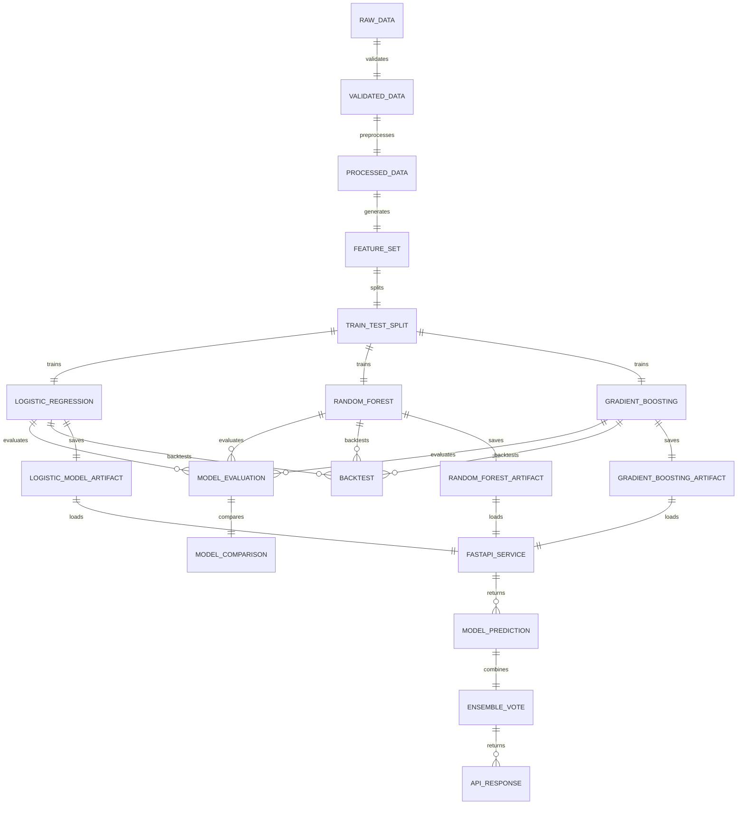
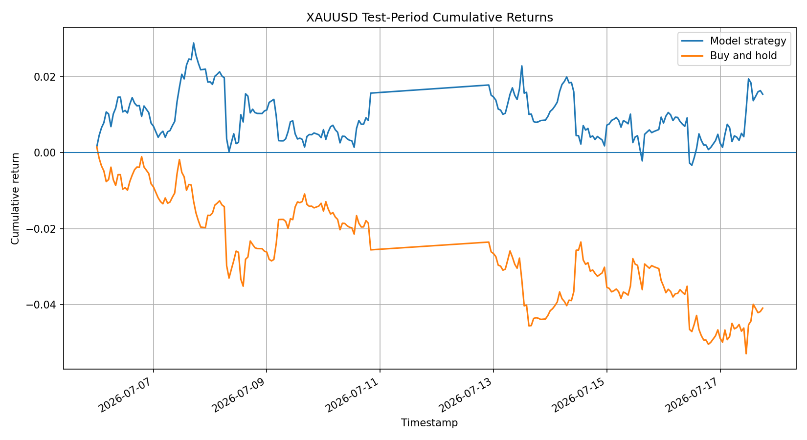

# Gold Price Direction Predictor

A machine-learning project that predicts whether the next hourly XAU/USD gold-price candle will move **up** or **down/flat**.

The project includes the complete workflow:

* Hourly gold-price data collection
* Data validation and preprocessing
* Feature engineering
* Chronological model training
* Time-series validation
* Trading-strategy evaluation
* FastAPI prediction service
* Automated testing
* Docker containerization


## Project Objective

The goal of this project is to predict the direction of the next hourly gold-price candle.

The model does not predict the exact future price. It predicts one of two classes:

* `1` — Price is expected to move up
* `0` — Price is expected to move down or remain flat

The prediction is based on technical features calculated using current and historical hourly market data.


## Project Workflow




## Features Used

The model uses five engineered features:

| Feature             | Description                                                     |
| ------------------- | --------------------------------------------------------------- |
| `return_1`          | Percentage return from the previous hourly candle               |
| `ma_gap`            | Difference between the current closing price and moving average |
| `volatility_10`     | Rolling volatility calculated using recent returns              |
| `candle_body_ratio` | Ratio of the candle body to the full high-low range             |
| `rsi_14`            | 14-period Relative Strength Index                               |

All features are calculated using only information available at or before the current timestamp.

## Target Variable

The classification target is created by comparing the next hourly close with the current close.

```python
target = (next_close > current_close).astype(int)
```

* `1`: The next hourly close is higher
* `0`: The next hourly close is lower or equal

The future closing price is used only to create the training target and is removed from the final model input dataset.

## Data Leakage Prevention

Financial time-series data must not be randomly split because that could allow future information to influence the training process.

This project uses:

* Chronological train-test splitting
* Purged boundary rows
* Time-ordered validation folds
* Feature calculations based only on current and past observations
* No future-price column in the model input

The training dataset always occurs before the testing dataset.

## Model

The project uses a Scikit-learn pipeline containing:

* Feature scaling
* Logistic Regression classifier

Logistic Regression was selected because it is:

* Easy to interpret
* Suitable as a classification baseline
* Fast to train
* Appropriate for a small financial dataset
* Able to return class probabilities

## Final Evaluation Results

The final model was evaluated on an unseen chronological test period.

### Classification Metrics

| Metric            | Result |
| ----------------- | -----: |
| Accuracy          | 53.10% |
| Balanced Accuracy | 53.48% |
| Precision         | 47.06% |
| Recall            | 56.57% |
| F1 Score          | 51.38% |
| ROC-AUC           | 57.57% |

### Trading Metrics

| Metric                   |    Result |
| ------------------------ | --------: |
| Test-period trades       |       226 |
| Win rate                 |    52.65% |
| Strategy return          |  +1.5437% |
| Buy-and-hold return      |  -4.0963% |
| Average return per trade | 0.007179% |

The model produced a positive strategy return during the test period while the buy-and-hold benchmark produced a negative return.

These results do not guarantee future profitability.

## Cumulative Return Curve

The generated cumulative-return chart compares:

* Model-based trading strategy
* Buy-and-hold benchmark



## Repository Structure

```text
gold-price-direction-predictor/
├── app/
│   ├── api/
│   ├── services/
│   ├── main.py
│   └── schemas.py
├── src/
│   ├── data/
│   │   ├── download.py
│   │   └── preprocess.py
│   ├── features/
│   │   └── build_features.py
│   ├── models/
│   │   ├── train.py
│   │   ├── validate.py
│   │   ├── evaluate.py
│   │   └── predict.py
│   └── evaluation/
├── tests/
├── artifacts/
│   ├── gold_direction_pipeline.joblib
│   ├── evaluation_metrics.json
│   ├── cumulative_returns.png
│   └── test_period_trades.csv
├── Dockerfile
├── .dockerignore
├── .gitignore
├── pyproject.toml
├── requirements.txt
└── README.md
```

## Installation

### 1. Clone the repository

```bash
git clone https://github.com/YOUR_USERNAME/gold-price-direction-predictor.git
cd gold-price-direction-predictor
```

### 2. Create a virtual environment

Windows PowerShell:

```powershell
python -m venv .venv
.venv\Scripts\Activate.ps1
```

Linux or macOS:

```bash
python -m venv .venv
source .venv/bin/activate
```

### 3. Install dependencies

```bash
pip install -r requirements.txt
```

## Run the Project Pipeline

The exact commands may depend on the module structure, but the main workflow is:

### Download data

```bash
python -m src.data.download
```

### Preprocess data

```bash
python -m src.data.preprocess
```

### Build features

```bash
python -m src.features.build_features
```

### Train the model

```bash
python -m src.models.train
```

### Run time-series validation

```bash
python -m src.models.validate
```

### Evaluate the final model

```bash
python -m src.models.evaluate
```

## FastAPI Service

Start the API locally:

```bash
uvicorn app.main:app --reload
```

Open the interactive Swagger documentation:

```text
http://127.0.0.1:8000/docs
```

## API Endpoints

### Root endpoint

```http
GET /
```

Returns basic information about the API.

### Health endpoint

```http
GET /health
```

Returns the API status and confirms whether the model was loaded successfully.

Example:

```json
{
  "status": "healthy",
  "model_loaded": true,
  "timestamp": "2026-07-18T12:00:00Z"
}
```

### Model information

```http
GET /model/info
```

Returns model metadata and the expected feature names.

### Prediction endpoint

```http
POST /predict
```

Example request:

```json
{
  "return_1": 0.0012,
  "ma_gap": -0.0021,
  "volatility_10": 0.0045,
  "candle_body_ratio": 0.62,
  "rsi_14": 54.3
}
```

Example response:

```json
{
  "predicted_class": 0,
  "direction": "down_or_flat",
  "probability_up": 0.48,
  "probability_down": 0.52,
  "confidence": 0.52,
  "threshold": 0.5
}
```

The exact probabilities depend on the supplied feature values.

## Run with Docker

### Build the image

```bash
docker build -t gold-direction-api .
```

### Run the container

```bash
docker run -d \
  --name gold-direction-container \
  -p 8000:8000 \
  gold-direction-api
```

For Windows PowerShell:

```powershell
docker run -d `
  --name gold-direction-container `
  -p 8000:8000 `
  gold-direction-api
```

Open Swagger:

```text
http://127.0.0.1:8000/docs
```

### View container logs

```bash
docker logs gold-direction-container
```

### Stop the container

```bash
docker stop gold-direction-container
```

### Remove the container

```bash
docker rm -f gold-direction-container
```

## Testing

Run all automated tests:

```bash
pytest
```

Current result:

```text
50 tests passed
```

Generate test coverage:

```bash
pytest --cov=app --cov=src
```

Current overall coverage:

```text
55%
```

Core API components have higher coverage:

* API main module: 81%
* Model service: 90%
* API schemas: 100%

## Code Quality

Run Ruff:

```bash
ruff check .
```

Run Mypy:

```bash
mypy app src
```

Current quality-check status:

```text
Ruff: All checks passed
Mypy: No issues found in 22 source files
Pytest: 50 tests passed
```

## Generated Artifacts

The project generates the following files:

| File                             | Description                               |
| -------------------------------- | ----------------------------------------- |
| `gold_direction_pipeline.joblib` | Saved trained Scikit-learn pipeline       |
| `evaluation_metrics.json`        | Final classification and trading metrics  |
| `cumulative_returns.png`         | Strategy and benchmark return chart       |
| `test_period_trades.csv`         | Test-period predictions and trade returns |

## Assumptions

* Hourly OHLC data is correctly ordered by timestamp.
* The prediction represents the direction of the next hourly close.
* Transaction costs, spread, slippage, and execution delays are not included.
* The evaluation assumes a simplified trading strategy.
* Historical performance may not continue in live markets.
* The project is designed as a machine-learning demonstration and not as financial advice.

## Architecture Documentation

Detailed system architecture, data flow, API sequence, Docker workflow, and model lifecycle diagrams are available here:

[View Architecture Documentation](/architecture.md)

## Project Evolution

Rather than training a single model once, I experimented with different datasets and model configurations to understand how historical data and model choice affect prediction performance.

### Phase 1 — Initial Model

- Historical data: **3 Months**
- Source: Yahoo Finance (`GC=F`)
- Interval: **1 Hour**
- Features: 5 engineered technical indicators
- Model: Logistic Regression

The initial implementation established a simple and interpretable baseline.

### Phase 2 — Extended Dataset

The dataset was expanded to approximately **6 months** of hourly Gold Futures data.

This increased the number of training observations and allowed the models to learn from a wider variety of market conditions.

### Phase 3 — Model Comparison

Instead of relying on a single algorithm, three machine-learning models were trained and evaluated using the same chronological train/test split:

- Logistic Regression
- Random Forest
- Gradient Boosting

| Model | Accuracy | Balanced Accuracy | Precision | Recall | F1 Score | ROC-AUC |
|:------|---------:|------------------:|----------:|--------:|---------:|--------:|
| **Logistic Regression** | **51.50%** | **51.56%** | **48.22%** | **52.41%** | **50.23%** | **52.47%** |
| **Random Forest** | **50.30%** | **50.45%** | **47.13%** | **52.73%** | **49.77%** | **52.42%** |
| **Gradient Boosting** | **50.30%** | **51.11%** | **47.58%** | **63.34%** | **54.34%** | **51.55%** |

This allowed direct comparison of prediction quality while keeping the dataset and feature engineering identical.

### Performance Summary

- **Logistic Regression** achieved the **highest overall accuracy (51.50%)** and **highest ROC-AUC (52.47%)**, making it the strongest baseline model.
- **Gradient Boosting** achieved the **highest Recall (63.34%)** and **highest F1 Score (54.34%)**, identifying more upward movements at the expense of lower precision.
- **Random Forest** delivered performance comparable to Logistic Regression but did not outperform it on any primary evaluation metric.


- Overall, all three models performed only slightly better than random guessing, highlighting the challenging nature of short-term financial market prediction.

## Docker

The application is containerized using Docker, making it easy to run the prediction API in any environment.

### Pull from Docker Hub

```bash
docker pull muskanchauhan2890/gold-direction-api:latest
```

Run the container:

```bash
docker run -d \
  --name gold-direction-api \
  -p 8000:8000 \
  muskanchauhan2890/gold-direction-api:latest
```

### Pull from GitHub Container Registry

```bash
docker pull ghcr.io/chauhanmuskan291980-wq/gold-price-direction-predictor:latest
```

Run the container:

```bash
docker run -d \
  --name gold-direction-ghcr \
  -p 8000:8000 \
  ghcr.io/chauhanmuskan291980-wq/gold-price-direction-predictor:latest
```

After starting the container, open:

* API documentation: `http://127.0.0.1:8000/docs`
* Health endpoint: `http://127.0.0.1:8000/health`
* Model information: `http://127.0.0.1:8000/model/info`
* Latest market prediction: `http://127.0.0.1:8000/predict/latest`

### Build Locally

```bash
docker build -t gold-direction-api:latest .
```

Run the locally built image:

```bash
docker run -d \
  --name gold-direction-api \
  -p 8000:8000 \
  gold-direction-api:latest
```

### Stop and Remove the Container

```bash
docker stop gold-direction-api
docker rm gold-direction-api
```

---

## CI/CD Pipeline

The project uses GitHub Actions for continuous integration and container delivery.

The pipeline runs automatically on:

* Pushes to the `main` branch
* Pull requests targeting the `main` branch

The workflow performs the following steps:

1. Installs Python dependencies
2. Runs Ruff code-quality checks
3. Runs Mypy static type checking
4. Executes the Pytest test suite
5. Builds the Docker image
6. Starts the container
7. Verifies the `/health` endpoint
8. Publishes the image to Docker Hub
9. Publishes the image to GitHub Container Registry

Docker images are published only after all quality checks, tests, and container health checks pass.

### Published Images

| Registry                  | Image                                                                  |
| ------------------------- | ---------------------------------------------------------------------- |
| Docker Hub                | `muskanchauhan2890/gold-direction-api:latest`                          |
| GitHub Container Registry | `ghcr.io/chauhanmuskan291980-wq/gold-price-direction-predictor:latest` |

Each successful push to `main` publishes:

* A `latest` tag
* A commit-specific tag using the Git commit SHA

Example:

```bash
docker pull muskanchauhan2890/gold-direction-api:<commit-sha>
```

```bash
docker pull ghcr.io/chauhanmuskan291980-wq/gold-price-direction-predictor:<commit-sha>
```

---

## Testing

Run all tests:

```bash
pytest
```

Run code-quality checks:

```bash
ruff check .
```

Run static type checking:

```bash
mypy app src
```

Run tests with coverage:

```bash
pytest --cov=app --cov=src --cov-report=term-missing
```

The project currently includes tests for:

* API endpoints
* Health checks
* Input validation
* Data downloading and validation
* Data preprocessing
* Feature engineering
* Model training
* Time-series validation
* Model prediction
* Model artifact loading

---

## API Usage

After starting the container, open:

* Swagger API documentation: `http://127.0.0.1:8000/docs`
* API health check: `http://127.0.0.1:8000/health`
* Model information: `http://127.0.0.1:8000/model/info`
* Latest market prediction: `http://127.0.0.1:8000/predict/latest`

### Health Check

Checks whether the API is running and whether the trained model artifacts were loaded successfully.

```bash
curl http://127.0.0.1:8000/health
```

Example response:

```json
{
  "status": "healthy",
  "models_loaded": true
}
```

### Model Information

Returns the available trained models, expected input features, and model metadata.

```bash
curl http://127.0.0.1:8000/model/info
```

### Compare Model Predictions

This endpoint accepts manually provided feature values and returns predictions from:

* Logistic Regression
* Random Forest
* Gradient Boosting
* Ensemble majority vote

```bash
curl -X POST "http://127.0.0.1:8000/predict/compare" \
  -H "Content-Type: application/json" \
  -d '{
    "return_1": 0.0012,
    "ma_gap": -0.0021,
    "volatility_10": 0.0045,
    "candle_body_ratio": 0.62,
    "rsi_14": 54.3
  }'
```

Example response:

```json
{
  "predictions": {
    "logistic_regression": {
      "predicted_class": 1,
      "direction": "up",
      "probability_up": 0.53,
      "probability_down": 0.47,
      "confidence": 0.53
    },
    "random_forest": {
      "predicted_class": 0,
      "direction": "down_or_flat",
      "probability_up": 0.49,
      "probability_down": 0.51,
      "confidence": 0.51
    },
    "gradient_boosting": {
      "predicted_class": 1,
      "direction": "up",
      "probability_up": 0.55,
      "probability_down": 0.45,
      "confidence": 0.55
    }
  },
  "ensemble_prediction": {
    "predicted_class": 1,
    "direction": "up",
    "votes_up": 2,
    "votes_down_or_flat": 1
  }
}
```

The exact probabilities depend on the supplied feature values and the trained model artifacts.

### Latest Market Prediction

This endpoint downloads the latest available hourly Gold Futures data from Yahoo Finance, generates the required features, and returns predictions from all trained models.

```bash
curl http://127.0.0.1:8000/predict/latest
```

Example response:

```json
{
  "symbol": "GC=F",
  "interval": "1h",
  "latest_candle_timestamp": "2026-07-20T18:00:00Z",
  "features": {
    "return_1": 0.0012,
    "ma_gap": -0.0021,
    "volatility_10": 0.0045,
    "candle_body_ratio": 0.62,
    "rsi_14": 54.3
  },
  "predictions": {
    "logistic_regression": {
      "predicted_class": 1,
      "direction": "up",
      "confidence": 0.53
    },
    "random_forest": {
      "predicted_class": 0,
      "direction": "down_or_flat",
      "confidence": 0.51
    },
    "gradient_boosting": {
      "predicted_class": 1,
      "direction": "up",
      "confidence": 0.55
    }
  },
  "ensemble_prediction": {
    "predicted_class": 1,
    "direction": "up"
  }
}
```

The `/predict/latest` endpoint demonstrates the complete inference workflow:

```text
Yahoo Finance Data
        ↓
Data Validation
        ↓
Feature Engineering
        ↓
Three Model Predictions
        ↓
Ensemble Majority Vote
        ↓
JSON Response
```


## Limitations

Financial markets are noisy and difficult to predict.

The current model has several limitations:

* A relatively small dataset
* Only five engineered features
* A simple linear classifier
* No transaction costs or slippage
* No live market-data integration
* No automatic model retraining
* No macroeconomic or news features
* No direct prediction of the future gold price
* Possible changes in market behaviour over time

A model accuracy slightly above 50% should be interpreted carefully.

## Possible Future Improvements

Potential extensions include:

* More historical data
* Additional technical indicators
* Walk-forward optimization
* Transaction-cost modelling
* Probability calibration
* Feature-importance analysis
* Gradient boosting models
* Live XAU/USD market-data integration
* Automatic next-hour prediction
* Model monitoring and scheduled retraining
* Cloud deployment

## Disclaimer

This project is for educational and technical demonstration purposes only.

It is not financial advice and should not be used as the sole basis for real trading or investment decisions.

## Technical Documentation

- [Data pipeline](docs/data_pipeline.md)
- [Feature engineering](docs/feature_engineering.md)
- [Model training](docs/model_training.md)
- [Evaluation and backtest](docs/evaluation_and_backtest.md)
- [FastAPI service](docs/api.md)
- [Architecture](docs/architecture.md)

## Author

**Muskan Chauhan**

Backend Developer and Applied AI/ML Engineer

* GitHub: https://github.com/chauhanmuskan291980-wq
* LinkedIn: https://www.linkedin.com/in/muskan-chauhan-0783b4325/
