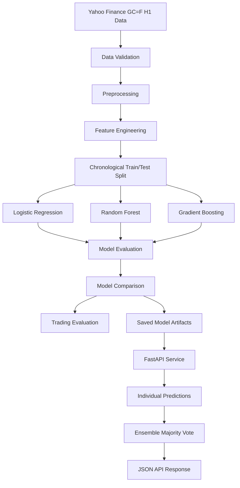

# Gold Price Direction Predictor

A production-style machine learning project that predicts whether the next hourly Gold Futures candle (`GC=F`) is likely to move **up** or **down/flat**.

The project includes an end-to-end workflow for data collection, validation, feature engineering, chronological model training, model comparison, trading evaluation, FastAPI inference, automated testing, Docker, and CI/CD.


---

## Project Objective

The objective is to classify the direction of the next hourly candle:

- `1` — the next close is higher
- `0` — the next close is lower or equal

The project does **not** predict the exact future gold price. It predicts direction using technical features calculated only from information available at or before the current timestamp.

---

## System Design



### Prediction Flow

```text
Hourly market data
        ↓
Feature generation
        ↓
Logistic Regression
Random Forest
Gradient Boosting
        ↓
Majority-vote ensemble
        ↓
FastAPI response
```

---

## Why These Features Were Chosen

The model uses five lightweight and interpretable technical features.

| Feature | Purpose |
|---|---|
| `return_1` | Captures immediate short-term momentum |
| `ma_gap` | Measures the distance between price and its moving average |
| `volatility_10` | Represents recent market uncertainty |
| `candle_body_ratio` | Measures directional candle strength |
| `rsi_14` | Captures relative momentum and overbought/oversold conditions |

These features were selected because they represent complementary market behaviour:

- **Momentum** — `return_1`, `rsi_14`
- **Trend** — `ma_gap`
- **Risk and uncertainty** — `volatility_10`
- **Price action** — `candle_body_ratio`

All features are computed from current and historical candles only. Future values are never included in the model inputs.

---

## Why Three Algorithms Were Used

Three classifiers were trained using the same data, features, and chronological split.

| Model | Reason for Selection |
|---|---|
| Logistic Regression | Provides a simple, interpretable baseline |
| Random Forest | Captures non-linear relationships and feature interactions |
| Gradient Boosting | Learns sequential corrections and can model complex decision boundaries |

Using multiple models makes it possible to compare different modelling assumptions instead of relying on a single algorithm.

The API also returns an **ensemble prediction** based on majority voting across the three classifiers.

---

## Preventing Look-Ahead Leakage

Financial time-series models must preserve chronological order because information from the future must never influence training.

This project prevents look-ahead leakage through:

* Chronological train/test splitting without random shuffling
* A one-row purged boundary between training and testing
* Features calculated only from current and historical candles
* Removal of temporary future-price columns before model training
* A target derived from the next close but never included as a model feature
* Scalers fitted only on training data through Scikit-learn pipelines
* Explicit automated tests that verify chronological ordering and the purged boundary

The split structure is:

```text
Training period
      ↓
One purged observation
      ↓
Unseen test period
```

The test suite includes:

```text
test_chronological_split_prevents_lookahead
test_chronological_split_purges_boundary_row
test_next_close_is_not_in_final_dataset
```


---

### Evaluation Dataset

The committed evaluation artifacts were generated from the committed dataset snapshot.

| Dataset Stage                |  Rows |
| ---------------------------- | ----: |
| Raw hourly candles           | 3,356 |
| Processed observations       | 3,355 |
| Feature observations         | 3,336 |
| Training observations        | 2,667 |
| Purged boundary observations |     1 |
| Test observations            |   668 |
| Strategy trades              |   667 |

The test set is chronological and completely unseen during training. One observation is removed between the training and test periods to create an explicit purged boundary and reduce the risk of look-ahead leakage.

---

## Model Results

The three models were evaluated on the same unseen chronological test period.

| Model               |   Accuracy | Balanced Accuracy |  Precision |     Recall |   F1 Score |    ROC-AUC |
| ------------------- | ---------: | ----------------: | ---------: | ---------: | ---------: | ---------: |
| Logistic Regression |     50.45% |            50.50% |     47.49% |     51.27% |     49.31% |     51.80% |
| Random Forest       | **51.50%** |        **51.63%** | **48.56%** |     53.82% |     51.06% | **52.06%** |
| Gradient Boosting   |     49.55% |            50.64% |     47.47% | **68.79%** | **56.18%** |     49.50% |

---

### Interpretation

* Random Forest achieved the highest accuracy, balanced accuracy, precision, and ROC-AUC on the unseen test period.
* Gradient Boosting achieved the highest recall and F1 score, indicating that it identified more upward candles but also produced more false-positive predictions.
* Logistic Regression was retained as the official baseline model because it is simpler, more interpretable, and uses standardized preprocessing inside a reproducible Scikit-learn pipeline.
* Overall performance remained close to random guessing, demonstrating the difficulty of predicting short-term financial-market direction.
* The weaker results are reported honestly and were reproduced using the committed dataset snapshot.

---
### Trading Strategy Results

The official Logistic Regression baseline was also evaluated as a simple directional trading strategy on the unseen test period.

| Metric                     |   Result |
| -------------------------- | -------: |
| Number of trades           |      667 |
| Winning trades             |      333 |
| Losing trades              |      334 |
| Win rate                   |   49.93% |
| Cumulative strategy return |   -7.36% |
| Buy-and-hold return        |   -6.46% |
| Average trade return       | -0.0108% |
| Best trade return          |    2.18% |
| Worst trade return         |   -1.76% |

The strategy produced a negative cumulative return. This result is intentionally reported rather than hidden or optimized away. The main goal of the project is to demonstrate a reproducible and leakage-aware machine-learning pipeline, not to claim a profitable trading system.

---

## Cumulative Return Curve

The generated cumulative-return chart compares:

* Model-based trading strategy
* Buy-and-hold benchmark


## Repository Structure

```text
gold-price-direction-predictor/
├── app/
│   ├── api/
│   │   └── routes.py
│   ├── services/
│   │   ├── model_service.py
│   │   └── latest_prediction_service.py
│   ├── main.py
│   └── schemas.py
├── src/
│   ├── data/
│   │   ├── download.py
│   │   └── preprocess.py
│   ├── features/
│   │   └── build_features.py
│   └── models/
│       ├── train.py
│       ├── evaluate.py
│       ├── validate.py
│       ├── predict.py
│       └── model_factory.py
├── tests/
├── docs/
├── data/
├── artifacts/
├── Dockerfile
├── pyproject.toml
├── requirements.txt
└── README.md
```

---

## Quick Start

### 1. Clone the repository

```bash
git clone https://github.com/chauhanmuskan291980-wq/gold-price-direction-predictor.git
cd gold-price-direction-predictor
```

### 2. Create and activate a virtual environment

```bash
python -m venv .venv
```

Windows PowerShell:

```powershell
.venv\Scripts\Activate.ps1
```

Linux or macOS:

```bash
source .venv/bin/activate
```

### 3. Install dependencies

```bash
pip install -r requirements.txt
```

### 4. Run the project pipeline

```bash
python -m src.data.preprocess
python -m src.features.build_features
python -m src.models.train
python -m src.models.evaluate
pytest
```

### 5. Start the API

```bash
uvicorn app.main:app --reload
```

Open Swagger documentation:

```text
http://127.0.0.1:8000/docs
```

---

## API Endpoints

| Method | Endpoint | Description |
|---|---|---|
| `GET` | `/` | Basic API information |
| `GET` | `/health` | API and model health status |
| `GET` | `/model/info` | Loaded model metadata |
| `POST` | `/predict/compare` | Predictions from all models and the ensemble |
| `GET` | `/predict/latest` | Prediction using the latest available Gold Futures data |

---

## Run with Docker

### Build locally

```bash
docker build -t gold-direction-api:latest .
```

### Run the container

```bash
docker run -d \
  --name gold-direction-api \
  -p 8000:8000 \
  gold-direction-api:latest
```

### Pull the published image

Docker Hub:

```bash
docker pull muskanchauhan2890/gold-direction-api:latest
```

GitHub Container Registry:

```bash
docker pull ghcr.io/chauhanmuskan291980-wq/gold-price-direction-predictor:latest
```

---

## Testing and Code Quality

Run tests:

```bash
pytest
```

Run Ruff:

```bash
ruff check .
```

Run Mypy:

```bash
mypy app src
```

Run coverage:

```bash
pytest --cov=app --cov=src --cov-report=term-missing
```

The test suite covers API routes, validation, data processing, feature engineering, model training, prediction, artifact loading, and time-series validation.

---

## CI/CD

GitHub Actions automatically runs on pushes and pull requests to `main`.

The workflow installs dependencies, runs Ruff, Mypy, and Pytest, builds the Docker image, starts the container, verifies the health endpoint, and publishes container images after successful checks.

---

## Design Decisions

- Used hourly Gold Futures data because the assignment required H1 candles.
- Used chronological splitting because random splitting is unsafe for financial time series.
- Selected simple Scikit-learn models for reproducibility and interpretability.
- Used the same feature set and test period for all models to ensure a fair comparison.
- Loaded trained models once during FastAPI startup for efficient inference.
- Used a router-based API structure to keep application setup separate from endpoint logic.
- Reported both classification metrics and trading-oriented evaluation.
- Kept model limitations visible instead of overstating predictive performance.

---

## Limitations

- Financial markets are noisy and difficult to predict.
- The dataset covers a limited historical period.
- Only five technical features are used.
- Transaction costs, spread, slippage, and execution delays are excluded.
- No macroeconomic, sentiment, or news features are included.
- Yahoo Finance data may differ from institutional XAU/USD feeds.
- Market behaviour can change over time.
- The model does not guarantee profitable live trading.
 
---

## Future Improvements

- Use a longer historical dataset
- Add walk-forward validation
- Include transaction costs and slippage
- Add feature-importance analysis
- Calibrate model probabilities
- Add scheduled retraining and model monitoring

---
---
---
## Quick Start

### 1. Clone the repository

```bash
git clone https://github.com/chauhanmuskan291980-wq/gold-price-direction-predictor.git
cd gold-price-direction-predictor
```

### 2. Create and activate a virtual environment

```bash
python -m venv .venv
```

Windows PowerShell:

```powershell
.venv\Scripts\Activate.ps1
```

Linux or macOS:

```bash
source .venv/bin/activate
```

### 3. Install dependencies

```bash
python -m pip install --upgrade pip
pip install -r requirements.txt
```

### 4. Reproduce the committed benchmark

The repository includes a committed raw-data snapshot. Do not run the download command before this workflow.

```bash
python -m src.data.preprocess
python -m src.features.build_features
python -m src.models.train
python -m src.models.evaluate
pytest
```

Expected test result:

```text
44 passed
```

The evaluation command regenerates:

```text
artifacts/evaluation_metrics.json
artifacts/model_metrics.json
artifacts/model_comparison.csv
artifacts/test_period_trades.csv
artifacts/cumulative_returns.png
```

### 5. Start the API

```bash
uvicorn app.main:app --reload
```

Open the Swagger documentation:

```text
http://127.0.0.1:8000/docs
```

### Optional: Refresh with current data

> Running this command overwrites the committed raw-data snapshot and changes the resulting metrics.

```bash
python -m src.data.download; `
python -m src.data.preprocess; `
python -m src.features.build_features; `
python -m src.models.train; `
python -m src.models.evaluate; `
pytest
```
---
---
---
## Technical Documentation

- [Architecture](docs/architecture.md)
- [Data Pipeline](docs/data_pipeline.md)
- [Feature Engineering](docs/feature_engineering.md)
- [Model Training](docs/model_training.md)
- [Evaluation and Backtest](docs/evaluation_and_backtest.md)
- [FastAPI Service](docs/api.md)

---

## Release

[Gold Price Direction Predictor v1.0.0](https://github.com/chauhanmuskan291980-wq/gold-price-direction-predictor/releases/tag/v1.0.0)

---

## Disclaimer

This project is intended for educational and technical demonstration purposes only. It is not financial advice and should not be used as the sole basis for trading or investment decisions.

---

## Author

**Muskan Chauhan**  
Backend Developer and Applied AI/ML Engineer

- [GitHub](https://github.com/chauhanmuskan291980-wq)
- [LinkedIn](https://www.linkedin.com/in/muskan-chauhan-0783b4325/)
