# Gold Price Direction Predictor — System Architecture

## 1. Purpose

This document explains the architecture and execution sequence of the Gold Price Direction Predictor.

The application predicts whether the next hourly XAU/USD closing price will move:

* `UP`
* `DOWN_OR_FLAT`

The system contains two main parts:

1. Machine-learning pipeline
2. FastAPI prediction service

The project does not predict the exact future gold price. It performs binary classification using engineered market features.

---

## 2. High-Level Architecture

```mermaid
flowchart LR
    A[Hourly XAU/USD Data] --> B[Data Download]
    B --> C[Data Validation]
    C --> D[Data Preprocessing]
    D --> E[Feature Engineering]
    E --> F[Chronological Split]
    F --> G[Model Training]
    G --> H[Time-Series Validation]
    H --> I[Final Evaluation]
    I --> J[Saved Model Artifact]
    J --> K[FastAPI Service]
    K --> L[Prediction Response]
```

---

## 3. Main System Components

The application is divided into the following modules.

```text
src/data/
    download.py
    preprocess.py

src/features/
    build_features.py

src/models/
    train.py
    validate.py
    evaluate.py
    predict.py

app/
    main.py
    schemas.py
    services/model_service.py

tests/
    Unit and API tests

artifacts/
    Trained model and evaluation outputs
```

---

## 4. Complete Application Sequence

The complete application workflow is:

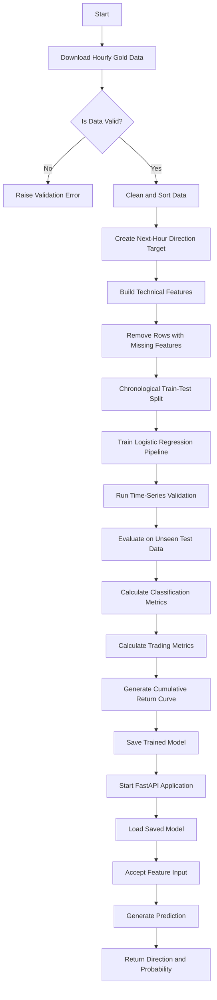

---

# Part 1: Data Pipeline

## 5. Data Download Sequence

The data-download module retrieves hourly XAU/USD market data.

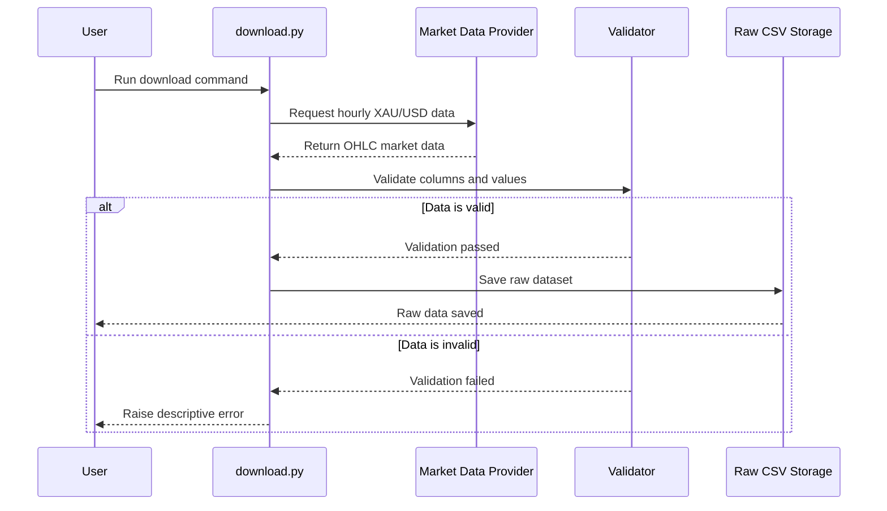

### Required market columns

The raw dataset contains:

```text
timestamp
open
high
low
close
volume
```

Depending on the data source, volume may be optional.

---

## 6. Data Validation

Before saving or processing the data, the application validates:

* Required columns exist
* Timestamps are valid
* Timestamps are unique
* Data is chronologically ordered
* OHLC prices are numeric
* High price is not below open, close, or low
* Low price is not above open, close, or high
* Missing or invalid rows are handled

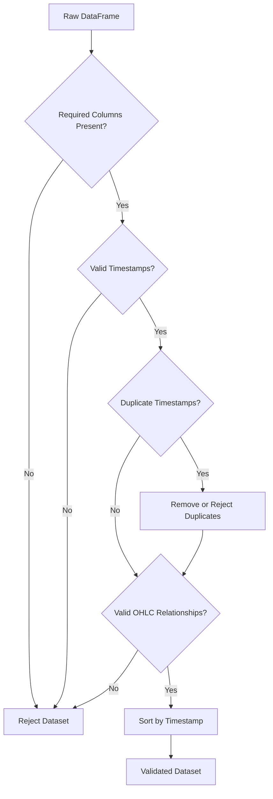

---

## 7. Data Preprocessing

The preprocessing stage prepares raw market data for feature engineering.

Main operations:

1. Load the raw dataset
2. Validate required columns
3. Convert timestamps
4. Convert price fields to numeric values
5. Remove duplicate rows
6. Remove invalid price rows
7. Sort records chronologically
8. Create the next-hour target
9. Save the processed dataset

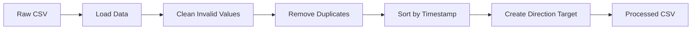

---

## 8. Target Creation

The prediction target represents the movement of the next hourly closing price.

```python
target = (next_close > current_close).astype(int)
```

Target values:

| Value | Meaning                                         |
| ----: | ----------------------------------------------- |
|   `1` | The next hourly closing price is higher         |
|   `0` | The next hourly closing price is lower or equal |

Example:

| Current Close | Next Close | Target |
| ------------: | ---------: | -----: |
|          3300 |       3310 |      1 |
|          3310 |       3305 |      0 |
|          3305 |       3305 |      0 |

The `next_close` value is used only to create the label.

It is removed before model training to prevent data leakage.

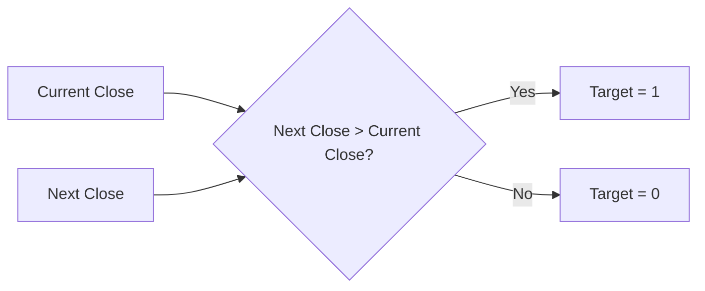

---

# Part 2: Feature Engineering

## 9. Feature Engineering Sequence

The processed OHLC data is converted into model-ready technical features.

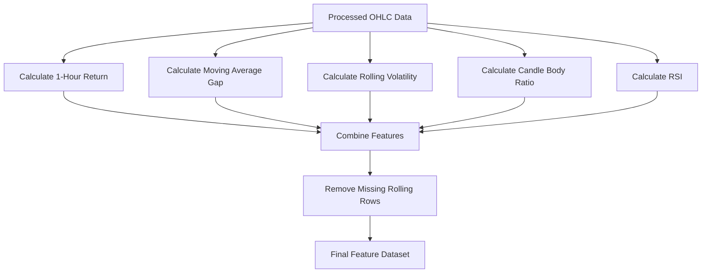

---

## 10. Model Features

The model uses five input features.

### 10.1 One-Hour Return

```text
return_1
```

Measures the percentage price change from the previous hourly candle.

```python
return_1 = close.pct_change()
```

---

### 10.2 Moving Average Gap

```text
ma_gap
```

Measures the distance between the current closing price and its moving average.

It indicates whether the current price is trading above or below its recent average.

---

### 10.3 Rolling Volatility

```text
volatility_10
```

Measures the standard deviation of recent hourly returns.

Higher values indicate greater price movement and uncertainty.

---

### 10.4 Candle Body Ratio

```text
candle_body_ratio
```

Measures the size of the candle body relative to the complete high-low range.

```python
abs(close - open) / (high - low)
```

A larger value indicates stronger directional movement within that candle.

---

### 10.5 Relative Strength Index

```text
rsi_14
```

RSI measures recent upward and downward price momentum.

Typical interpretation:

| RSI range | General interpretation |
| --------: | ---------------------- |
|  Below 30 | Potentially oversold   |
|     30–70 | Neutral range          |
|  Above 70 | Potentially overbought |

The model uses RSI as a numerical input rather than following fixed trading rules.

---

# Part 3: Model Training

## 11. Training Architecture

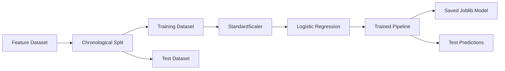

---

## 12. Why Chronological Splitting Is Used

Random train-test splitting is inappropriate for financial time-series data.

A random split could place future observations in the training set and older observations in the testing set.

This would create unrealistic evaluation results.

The project uses:

```text
Older observations → Training set
Newer observations → Testing set
```

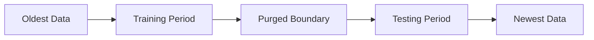

The boundary row is purged to reduce leakage between the training and testing periods.

---

## 13. Training Sequence

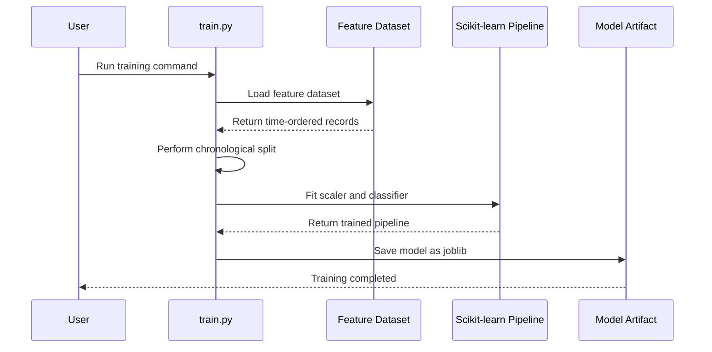

---

## 14. Machine-Learning Pipeline

The model is stored as a Scikit-learn pipeline.

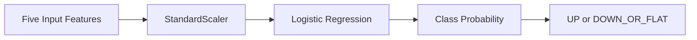

Using a pipeline ensures that the same scaling transformation is used during:

* Training
* Validation
* Testing
* API prediction

---

# Part 4: Time-Series Validation

## 15. Validation Process

The project uses multiple chronological validation folds.

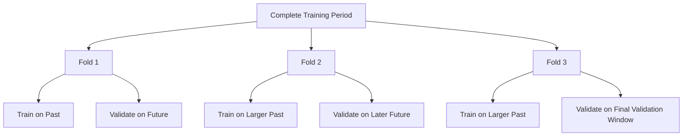

Example:

```text
Fold 1: Train [1–300]   Validate [301–400]
Fold 2: Train [1–400]   Validate [401–500]
Fold 3: Train [1–500]   Validate [501–600]
```

The validation data always occurs after the corresponding training data.

---

## 16. Baseline Comparison

The model is compared with a simple baseline.

A baseline helps answer:

> Is the machine-learning model learning something useful, or is it performing similarly to a simple prediction rule?

Possible baseline behaviour:

```text
Always predict the majority class
```

The model should be interpreted relative to the baseline rather than using accuracy alone.

---

# Part 5: Final Evaluation

## 17. Evaluation Sequence

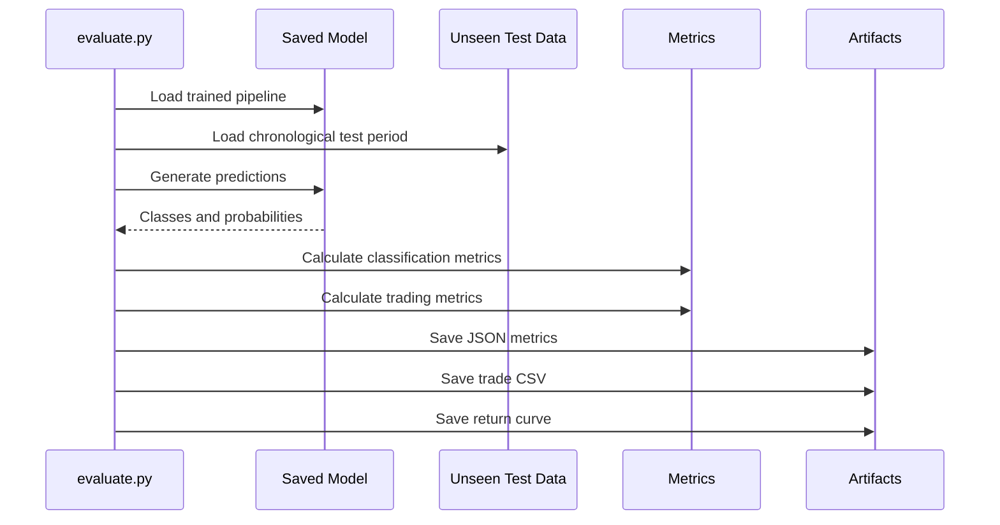

---

## 18. Classification Metrics

The final model is evaluated using:

* Accuracy
* Balanced accuracy
* Precision
* Recall
* F1 score
* ROC-AUC

Final results:

| Metric            | Result |
| ----------------- | -----: |
| Accuracy          | 53.10% |
| Balanced Accuracy | 53.48% |
| Precision         | 47.06% |
| Recall            | 56.57% |
| F1 Score          | 51.38% |
| ROC-AUC           | 57.57% |

---

## 19. Trading Evaluation

The project also evaluates a simplified model-based trading strategy.

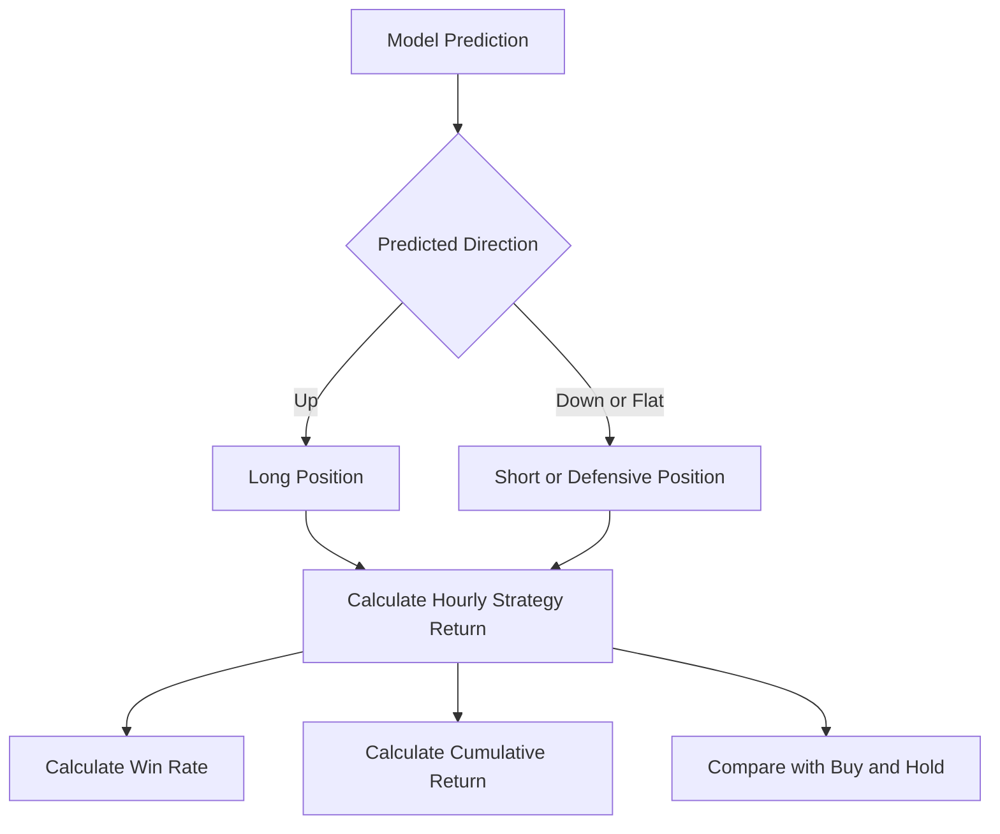

Final trading results:

| Metric               |    Result |
| -------------------- | --------: |
| Number of trades     |       226 |
| Win rate             |    52.65% |
| Strategy return      |  +1.5437% |
| Buy-and-hold return  |  -4.0963% |
| Average trade return | 0.007179% |

Transaction costs, spreads, slippage, and execution delay are not included.

---

## 20. Evaluation Artifacts

The evaluation stage generates:

```text
artifacts/
├── evaluation_metrics.json
├── cumulative_returns.png
├── test_period_trades.csv
└── gold_direction_pipeline.joblib
```

### Artifact responsibilities

| Artifact                         | Purpose                                               |
| -------------------------------- | ----------------------------------------------------- |
| `gold_direction_pipeline.joblib` | Stores the trained model pipeline                     |
| `evaluation_metrics.json`        | Stores classification and strategy metrics            |
| `cumulative_returns.png`         | Visual comparison of model and benchmark returns      |
| `test_period_trades.csv`         | Stores individual test-period predictions and returns |

---

# Part 6: FastAPI Prediction Service

## 21. API Architecture

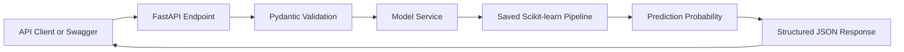

---

## 22. API Startup Sequence

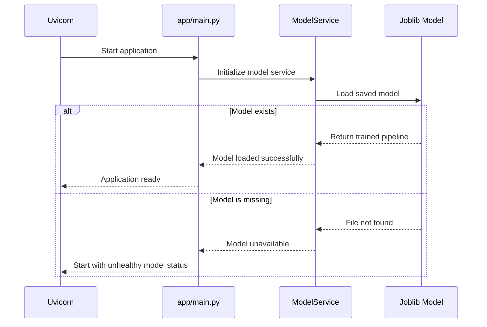

---

## 23. Prediction Request Sequence

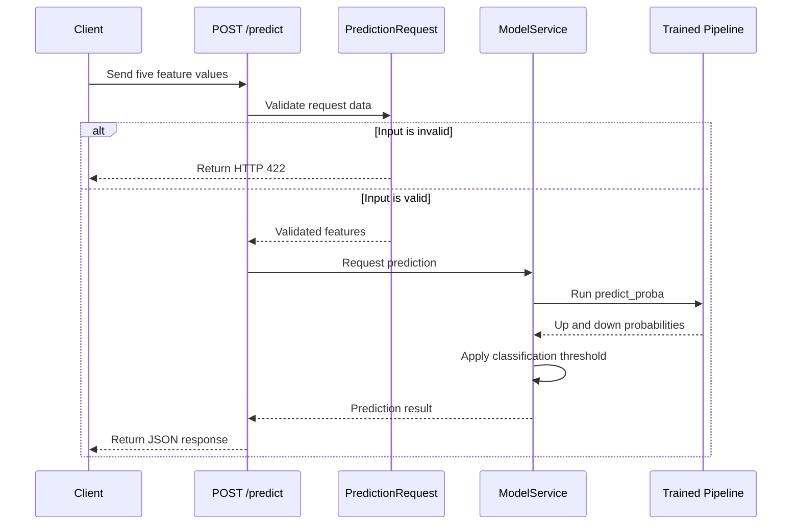

---

## 24. Prediction Endpoint

Endpoint:

```http
POST /predict
```

Request:

```json
{
  "return_1": 0.0012,
  "ma_gap": -0.0021,
  "volatility_10": 0.0045,
  "candle_body_ratio": 0.62,
  "rsi_14": 54.3
}
```

Response:

```json
{
  "predicted_class": 0,
  "direction": "down_or_flat",
  "probability_up": 0.48,
  "probability_down": 0.52,
  "confidence": 0.52,
  "threshold": 0.5
}
```

The exact response values depend on the input features and trained model.

---

## 25. API Endpoints

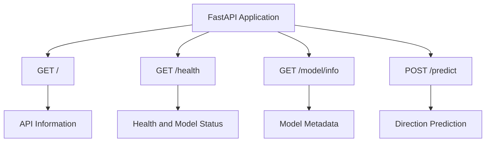

### Endpoint responsibilities

| Endpoint          | Responsibility                            |
| ----------------- | ----------------------------------------- |
| `GET /`           | Returns API information                   |
| `GET /health`     | Returns service and model status          |
| `GET /model/info` | Returns model details and feature names   |
| `POST /predict`   | Returns the predicted next-hour direction |

---

# Part 7: Docker Architecture

## 26. Container Architecture

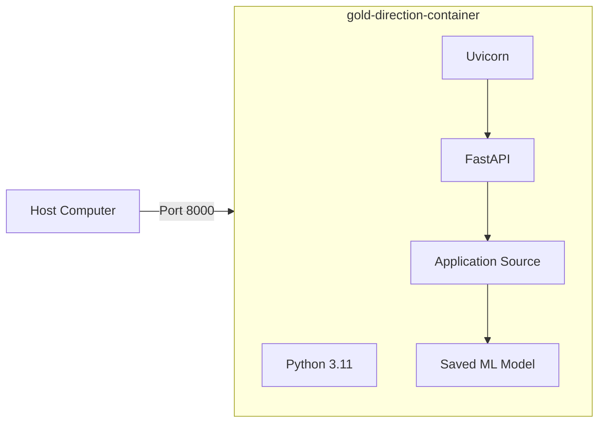

---

## 27. Docker Build Sequence

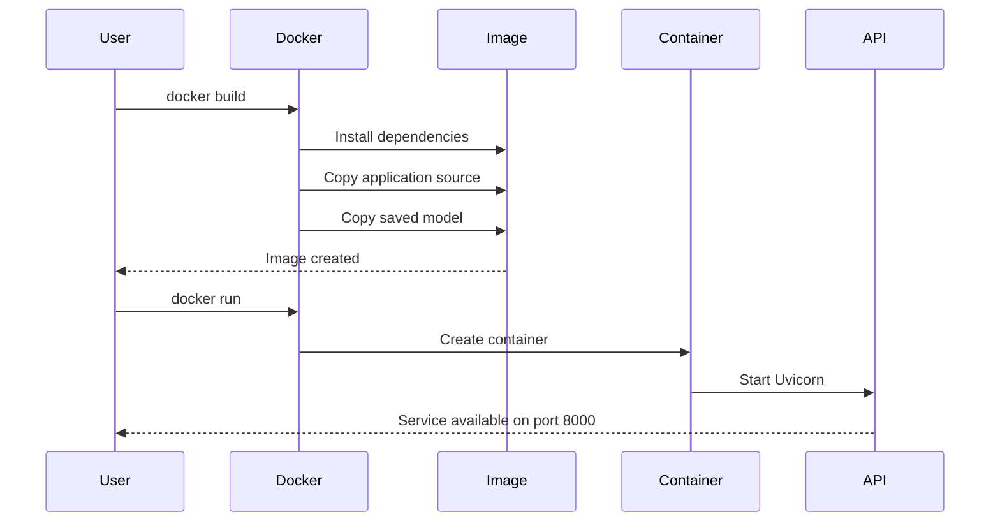

---

# Part 8: Testing Architecture

## 28. Testing Strategy

```mermaid
flowchart TD
    A[Test Suite] --> B[Data Download Tests]
    A --> C[Preprocessing Tests]
    A --> D[Feature Tests]
    A --> E[Training Tests]
    A --> F[Validation Tests]
    A --> G[Prediction Tests]
    A --> H[API Tests]

    B --> I[50 Passing Tests]
    C --> I
    D --> I
    E --> I
    F --> I
    G --> I
    H --> I
```

The test suite verifies:

* Input data validation
* Duplicate timestamp handling
* Invalid price detection
* Target creation
* Feature generation
* Missing-value handling
* Chronological splitting
* Model training
* Model saving
* Time-series validation
* Prediction input validation
* API health
* API prediction
* Invalid API requests

Current result:

```text
50 tests passed
55% overall coverage
```

---

# Part 9: Folder Responsibilities

## 29. Source Folder Responsibilities

### `src/data`

Responsible for:

* Downloading market data
* Validating raw data
* Cleaning data
* Creating the target
* Saving raw and processed datasets

### `src/features`

Responsible for:

* Calculating technical indicators
* Producing model-ready features
* Removing unusable rolling-window rows

### `src/models`

Responsible for:

* Training the classifier
* Running chronological validation
* Evaluating model performance
* Making command-line predictions
* Saving model artifacts

### `app`

Responsible for:

* Exposing the trained model through FastAPI
* Validating request and response structures
* Loading the saved model
* Returning prediction probabilities

### `tests`

Responsible for:

* Verifying expected behaviour
* Detecting regressions
* Testing invalid inputs
* Testing API endpoints

### `artifacts`

Responsible for storing:

* Trained model
* Metrics
* Trading results
* Charts

---

# Part 10: End-to-End Execution Order

## 30. Recommended Command Sequence

Run the project in this order:

```text
1. Download data
2. Preprocess data
3. Build features
4. Train model
5. Validate model
6. Evaluate final test period
7. Start FastAPI
8. Test API
9. Build Docker image
10. Run Docker container
```

Commands:

```bash
python -m src.data.download
python -m src.data.preprocess
python -m src.features.build_features
python -m src.models.train
python -m src.models.validate
python -m src.models.evaluate
uvicorn app.main:app --reload
```

Docker:

```bash
docker build -t gold-direction-api .
docker run -d --name gold-direction-container -p 8000:8000 gold-direction-api
```

---

# Part 11: Prediction Explanation

## 31. What the Model Predicts

At prediction time, the model receives five already calculated features.

```mermaid
flowchart LR
    A[Current and Historical Candles] --> B[Feature Calculation]
    B --> C[Five Feature Values]
    C --> D[Trained Model]
    D --> E[Next-Hour Direction]
```

The current API accepts the feature values directly.

It does not automatically download the latest candle.

This keeps the assignment architecture simple and makes the machine-learning prediction logic easy to demonstrate.

---

## 32. What the Model Does Not Do

The model does not:

* Predict an exact future gold price
* Predict using only a date
* Automatically fetch live market prices
* Guarantee profitable trades
* Include news or macroeconomic information
* Include transaction costs
* Automatically retrain itself

---

# Part 12: Design Decisions

## 33. Why Logistic Regression Was Selected

Logistic Regression provides:

* A simple classification baseline
* Fast training
* Probability output
* Easy interpretation
* Stable behaviour on small datasets
* Easy deployment through Scikit-learn

A more complicated model does not automatically produce more reliable financial predictions.

---

## 34. Why FastAPI Was Selected

FastAPI provides:

* Automatic input validation
* Interactive Swagger documentation
* Structured JSON responses
* Strong Python typing support
* Easy integration with machine-learning models
* Simple Docker deployment

---

## 35. Why the Model Is Saved as a Pipeline

Saving the complete pipeline ensures that preprocessing and prediction remain consistent.

```text
Input features
    ↓
Saved scaler
    ↓
Saved classifier
    ↓
Prediction
```

The API does not need to train the model again.

It only loads the saved pipeline and performs inference.

---

# Part 13: Limitations and Risks

## 36. Technical Limitations

* Limited historical dataset
* Only five engineered features
* Simple linear classifier
* No live market-data integration
* No automatic retraining
* No model-drift monitoring
* No cloud deployment
* No persistent prediction database

---

## 37. Financial Limitations

* Gold markets are noisy and unpredictable
* Historical patterns may not continue
* Transaction costs are not included
* Bid-ask spread is not included
* Slippage is not included
* Prediction latency is not included
* Strategy results are based on historical simulation
* A small directional advantage may disappear in live trading

---

# Part 14: Future Architecture

## 38. Possible Extended Architecture

A future version could use this architecture:

```mermaid
flowchart LR
    A[Live Market API] --> B[Scheduled Data Collector]
    B --> C[Feature Service]
    C --> D[Prediction API]
    D --> E[Prediction Database]
    D --> F[Dashboard]
    D --> G[Notification Service]

    H[Model Monitoring] --> I{Performance Degraded?}
    I -- Yes --> J[Retraining Pipeline]
    J --> K[Model Registry]
    K --> D
```

Possible additions:

* Live hourly data
* Automated feature calculation
* `/predict/latest` endpoint
* Prediction history
* Model monitoring
* Scheduled retraining
* Cloud deployment
* Dashboard
* Email or WhatsApp notifications

These additions are outside the current assignment scope.

---

# 15. Final Architecture Summary

The application follows a simple and modular architecture:

```text
Market Data
    ↓
Validation and Cleaning
    ↓
Target Creation
    ↓
Feature Engineering
    ↓
Chronological Training
    ↓
Time-Series Validation
    ↓
Final Evaluation
    ↓
Saved Model
    ↓
FastAPI Prediction
    ↓
Docker Deployment
```

The design separates:

* Data processing
* Feature engineering
* Model training
* Evaluation
* API serving
* Testing
* Deployment

This makes the project easier to understand, test, maintain, and extend.
