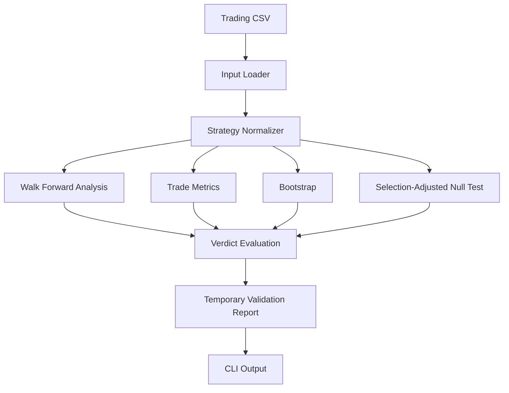
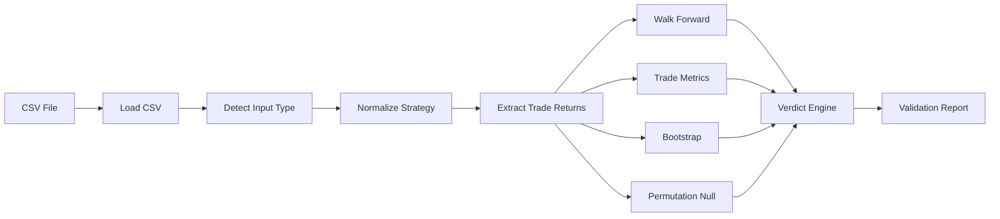
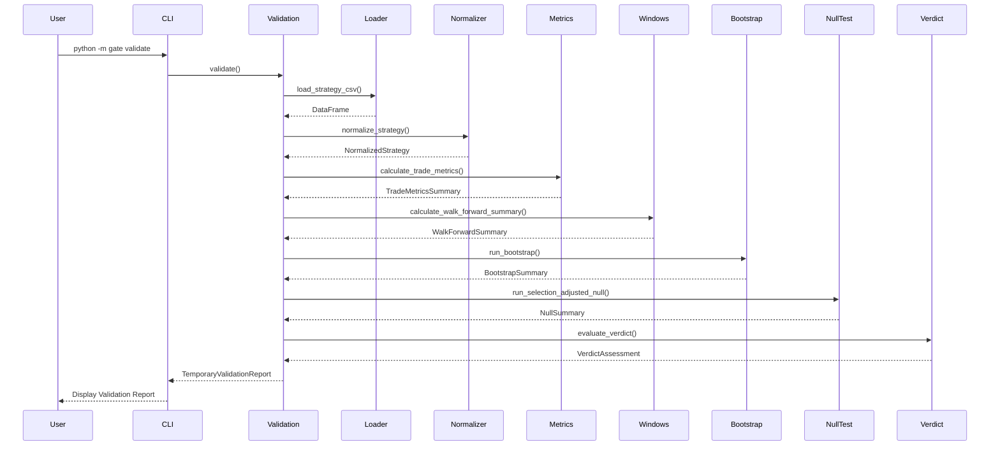
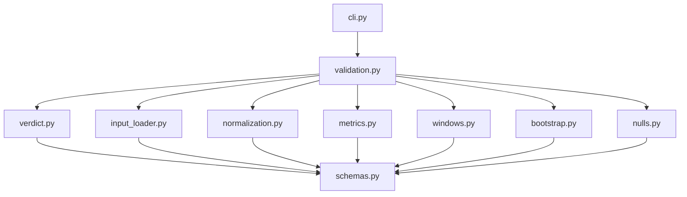
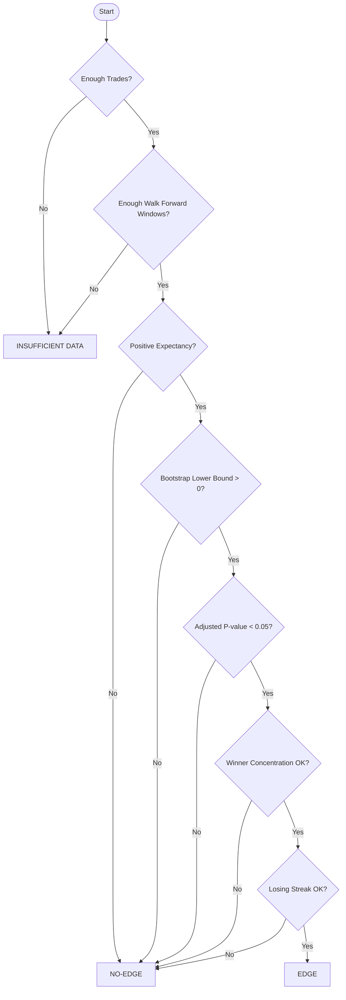
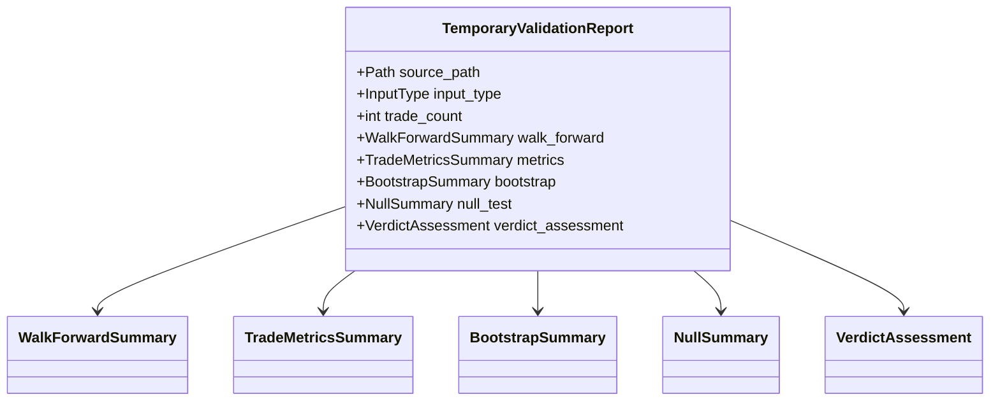

# Signal Validation Gate
# Software Design Document (SDD)

> **Project Type:** Statistical Validation Framework for Quantitative Trading Strategies  
> **Language:** Python 3.10+  
> **Architecture:** Modular Layered Architecture (Pipeline Pattern + Single Responsibility Principle)  
> **Author:** Muskan Chauhan

---

# Table of Contents

1. Introduction
2. Problem Statement
3. System Objectives
4. High-Level Architecture
5. Validation Pipeline
6. Software Design Pattern
7. Project Structure
8. Module Responsibilities
9. Data Flow
10. Validation Algorithms
11. Statistical Components
12. Validation Decision Framework
13. Testing Strategy
14. CLI Workflow
15. Design Principles
16. Future Improvements

---

# 1. Introduction

The **Signal Validation Gate** is a statistical validation framework designed to determine whether a quantitative trading strategy demonstrates a genuine statistical edge **before** it is used for machine learning model training.

Instead of relying on a single performance metric such as Profit Factor or Total Return, the framework combines multiple independent statistical validation techniques to measure robustness, consistency, and statistical significance.

The framework is designed to answer one question:

> **"Does this strategy truly contain predictive information, or is the observed performance likely caused by randomness?"**

---

# 2. Problem Statement

Many trading strategies appear profitable because of:

- Random chance
- Curve fitting
- Data snooping
- Multiple hypothesis testing
- Overfitting
- Small sample sizes

Training an ML model on these strategies often results in poor real-world performance.

The Signal Validation Gate ensures that only statistically validated strategies are passed to downstream ML pipelines.

---

# 3. System Objectives

The framework is designed to:

- Support multiple trading CSV formats
- Normalize heterogeneous datasets
- Perform chronological walk-forward evaluation
- Compute robust trading statistics
- Estimate confidence using bootstrap resampling
- Correct for multiple testing using permutation null distributions
- Produce reproducible validation reports
- Return a deterministic final verdict

---

# 4. High-Level Architecture



---

# 5. Complete Validation Pipeline



---

# 6. Software Design Pattern

The project follows a **Layered Pipeline Architecture**.

## Layer 1 — Data Access

Responsible for reading strategy files.

```
input_loader.py
```

---

## Layer 2 — Data Transformation

Converts every supported strategy format into one standardized representation.

```
normalization.py
```

---

## Layer 3 — Statistical Analysis

Independent statistical modules.

```
windows.py
metrics.py
bootstrap.py
nulls.py
```

Each module performs exactly one task.

---

## Layer 4 — Decision Layer

```
verdict.py
```

Consumes statistical evidence and generates the final decision.

---

## Layer 5 — Orchestration Layer

```
validation.py
```

Coordinates every component.

No statistical logic lives here.

---

## Layer 6 — Presentation Layer

```
cli.py
```

Responsible only for displaying results.

---

# 7. Project Structure

```text
gate/
│
├── __init__.py
├── __main__.py
├── cli.py
├── validation.py
├── schemas.py
│
├── input_loader.py
├── normalization.py
├── metrics.py
├── windows.py
├── bootstrap.py
├── nulls.py
├── verdict.py
```

---

# 8. Module Responsibilities

## input_loader.py

**Purpose**

Reads strategy CSV files.

### Responsibilities

- Detect input format
- Validate required columns
- Return DataFrame
- Identify InputType

---

## normalization.py

**Purpose**

Transforms all supported strategy formats into a common representation.

### Output

```
NormalizedStrategy
```

Contains:

- trade_returns
- trade_count
- return_unit
- input_type

---

## windows.py

**Purpose**

Performs chronological walk-forward validation.

Produces:

```
WalkForwardSummary
```

Metrics:

- Window count
- Median expectancy
- Worst expectancy
- Positive window rate
- Expectancy IQR

---

## metrics.py

Computes observed trading statistics.

Produces:

```
TradeMetricsSummary
```

Includes:

- Expectancy
- Profit Factor
- Win Rate
- Gross Profit
- Gross Loss
- Losing Streak
- Winner Concentration

---

## bootstrap.py

Performs bootstrap resampling.

Produces:

```
BootstrapSummary
```

Contains:

- Observed expectancy
- Lower confidence bound
- Profit factor lower bound
- Iterations
- Seed

---

## nulls.py

Performs selection-adjusted permutation testing.

Produces:

```
NullSummary
```

Contains:

- Adjusted p-value
- Null threshold
- Observed statistic

---

## verdict.py

Combines every statistical result into one decision.

Produces:

```
VerdictAssessment
```

Possible outputs:

- EDGE
- NO-EDGE
- INSUFFICIENT DATA

---

## validation.py

Acts as the orchestration layer.

Pipeline:

```
Loader
    ↓
Normalizer
    ↓
Walk Forward
    ↓
Metrics
    ↓
Bootstrap
    ↓
Null Test
    ↓
Verdict
    ↓
Validation Report
```

---

## cli.py

Presentation layer.

Displays:

- Walk Forward
- Metrics
- Bootstrap
- Null Test
- Verdict

---

# Sequence Diagram

---

---

# Module Dependency Diagram

---

---

# Decision Flowchart
---

---

# Class Diagram
---

---
# 9. Data Flow

```text
CSV File
    │
    ▼
load_strategy_csv()
    │
    ▼
normalize_strategy()
    │
    ▼
trade_returns
    │
    ├──────────────┐
    ▼              ▼
Trade Metrics   Walk Forward
    │              │
    └──────┬───────┘
           ▼
     Bootstrap
           │
           ▼
 Selection Null Test
           │
           ▼
 evaluate_verdict()
           │
           ▼
TemporaryValidationReport
           │
           ▼
CLI Output
```

---

# 10. Validation Algorithms

The validation framework combines multiple independent statistical analyses.

| Stage | Purpose |
|---------|----------|
| Walk Forward | Stability through time |
| Trade Metrics | Observed performance |
| Bootstrap | Confidence estimation |
| Null Test | Statistical significance |
| Verdict | Rule-based decision |

---

# 11. Statistical Components

## Walk Forward

Evaluates chronological robustness.

Measures:

- Median Expectancy
- Worst Window
- Positive Window Rate

---

## Trade Metrics

Measures actual trading performance.

Includes:

- Expectancy
- Profit Factor
- Win Rate
- Losing Streak
- Winner Concentration

---

## Bootstrap

Uses random resampling to estimate confidence.

Answers:

> "How much could these statistics change due to random sampling?"

---

## Selection-Adjusted Null

Uses sign-permutation testing.

Answers:

> "If many strategy configurations were tested, is this strategy still statistically significant?"

---

## Verdict Policy

Combines all evidence.

Requirements include:

- Minimum trade count
- Minimum walk-forward windows
- Positive expectancy
- Positive bootstrap lower bounds
- Significant adjusted p-value
- Acceptable winner concentration
- Limited losing streak

---

# 12. Validation Decision Framework

```text
                    Statistical Evidence
                             │
                             ▼
                 ┌──────────────────────┐
                 │  Verdict Assessment  │
                 └──────────┬───────────┘
                            │
        ┌───────────────────┼────────────────────┐
        ▼                   ▼                    ▼
 INSUFFICIENT DATA       NO-EDGE              EDGE
```

---

# 13. Testing Strategy

Each module is verified independently.

## Static Analysis

```bash
ruff check gate
mypy gate
```

---

## Manual Validation

```bash
python -m gate validate ...
```

---

## Programmatic Testing

```python
report = validate(...)
print(report.to_dict())
```

---

## Future

- pytest
- integration tests
- benchmark tests
- property-based testing

---

# 14. CLI Workflow

```text
User
 │
 ▼
python -m gate validate
 │
 ▼
Validation Pipeline
 │
 ▼
Statistical Analysis
 │
 ▼
Final Report
```

---

# 15. Design Principles

The project follows several software engineering principles.

## Single Responsibility Principle (SRP)

Each module has exactly one responsibility.

---

## Separation of Concerns

- Loading
- Normalization
- Statistics
- Decision
- Presentation

remain completely independent.

---

## Pipeline Pattern

Each stage consumes the previous stage's output.

```
Input

↓

Transform

↓

Analyze

↓

Decide

↓

Report
```

---

## Immutable Data Objects

All summaries use frozen dataclasses.

Benefits:

- Thread-safe
- Predictable
- Easy testing

---

## Type Safety

The project uses:

- Type hints
- mypy
- dataclasses
- enums

to minimize runtime errors.

---

# 16. Future Improvements

Planned enhancements include:

- Unit testing with pytest
- HTML report generation
- PDF export
- JSON output mode
- YAML configuration
- Interactive dashboard
- Batch strategy validation
- Parallel bootstrap execution
- REST API
- Web interface
- CI/CD integration
- Performance benchmarking

---

# Conclusion

The **Signal Validation Gate** provides a complete, modular, and statistically rigorous framework for evaluating quantitative trading strategies before machine learning training.

By combining:

- Input validation
- Strategy normalization
- Walk-forward analysis
- Observed trade metrics
- Bootstrap confidence estimation
- Selection-adjusted permutation testing
- Rule-based verdict evaluation

the framework ensures that only statistically supported trading strategies progress to downstream modeling.

The modular architecture, strong separation of concerns, immutable data models, and layered pipeline design make the system easy to extend, test, and maintain while adhering to modern software engineering best practices.