# Gold Price Direction Predictor — System Architecture

## 1. Purpose

This document explains the architecture and end-to-end execution flow of the **Gold Price Direction Predictor**.

The system predicts whether the next hourly Gold candle will move:

- `UP`
- `DOWN_OR_FLAT`

The project performs binary classification. It does not predict the exact future Gold price.

The implementation contains two main subsystems:

1. A machine-learning experimentation and evaluation pipeline
2. A FastAPI inference service

The project started with approximately **3 months of hourly data and one Logistic Regression model**. It was later expanded to approximately **6 months of hourly data**, and three models were trained under the same chronological evaluation setup:

- Logistic Regression
- Random Forest
- Gradient Boosting

---

## 2. Technology Stack

| Area | Technology |
|---|---|
| Language | Python |
| Data source | Yahoo Finance |
| Data package | `yfinance` |
| Data processing | pandas, NumPy |
| Machine learning | scikit-learn |
| API | FastAPI |
| Server | Uvicorn |
| Model persistence | Joblib |
| Testing | Pytest |
| Static analysis | Ruff and Mypy |
| Containerization | Docker |
| CI/CD | GitHub Actions |

---

## 3. Data Source

The pipeline downloads hourly Gold Futures data from Yahoo Finance.

```text
Symbol: GC=F
Interval: 1h
Final history window: approximately 6 months
```

`GC=F` represents Gold Futures. It is used as a freely available and liquid proxy for the Gold market, but it is not identical to broker-specific spot `XAU/USD`.

---

## 4. High-Level Architecture

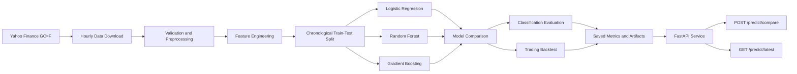

---

## 5. Main Project Components

```text
src/
├── data/
│   ├── download.py
│   └── preprocess.py
├── features/
│   └── build_features.py
├── models/
│   ├── train.py
│   ├── validate.py
│   ├── evaluate.py
│   └── predict.py
└── evaluation/

app/
├── main.py
├── schemas.py
└── services/

data/
├── raw/
└── processed/

artifacts/
├── models/
│   ├── logistic_regression.joblib
│   ├── random_forest.joblib
│   └── gradient_boosting.joblib
├── model_comparison.csv
├── evaluation_metrics.json
├── cumulative_returns.png
└── test_period_trades.csv

tests/
docs/
Dockerfile
requirements.txt
pyproject.toml
README.md
```

---

## 6. End-to-End Application Flow

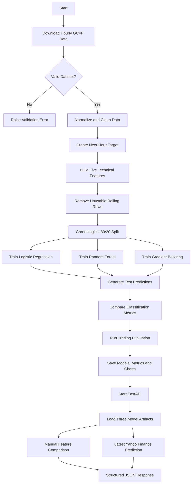

---

# Part 1: Data Pipeline

## 7. Data Download Sequence

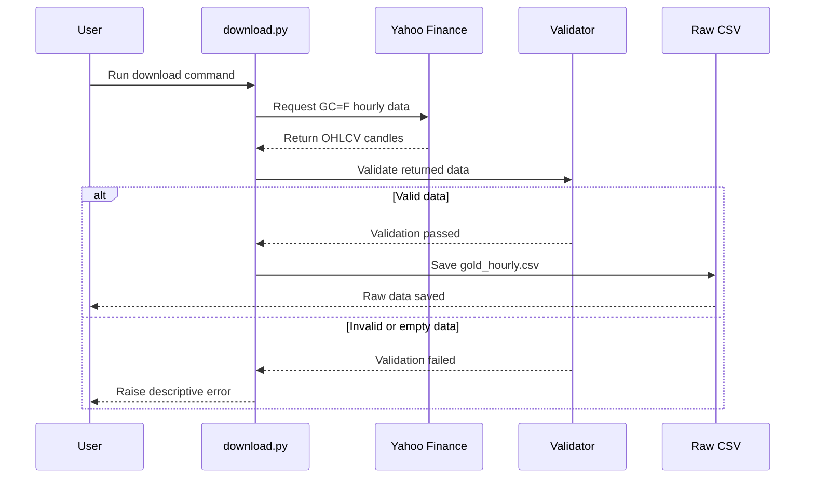

The raw dataset contains:

```text
timestamp
open
high
low
close
volume
```

Depending on Yahoo Finance output, adjusted-close columns may also be returned and normalized during preprocessing.

---

## 8. Dataset Evolution

The project was developed in multiple stages.

| Stage | Dataset | Models | Purpose |
|---|---|---|---|
| Initial baseline | Approximately 3 months | Logistic Regression | Establish a simple, interpretable baseline |
| Expanded experiment | Approximately 6 months | Logistic Regression | Test whether additional history improves stability |
| Final comparison | Approximately 6 months | Logistic Regression, Random Forest, Gradient Boosting | Compare linear and nonlinear classifiers fairly |

All final models use the same:

- Hourly dataset
- Five engineered features
- Chronological train/test split
- Target definition
- Test period

This makes the model comparison consistent and reproducible.

---

## 9. Data Validation

Before saving or processing the data, the application checks that:

- Required columns exist
- The dataset is not empty
- Timestamps are valid
- Timestamps are unique or safely deduplicated
- Records are chronologically ordered
- OHLC values are numeric
- `high` is not lower than `open`, `close`, or `low`
- `low` is not higher than `open`, `close`, or `high`
- Missing or invalid rows are handled

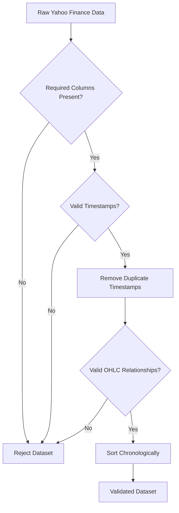

---

## 10. Target Creation

The target represents the direction of the next hourly closing price.

```python
target = (next_close > current_close).astype(int)
```

| Target | Meaning |
|---:|---|
| `1` | The next hourly close is higher |
| `0` | The next hourly close is lower or equal |

The future close is used only to create the historical label. It is never included in the model input features.

---

# Part 2: Feature Engineering

## 11. Feature Engineering Flow

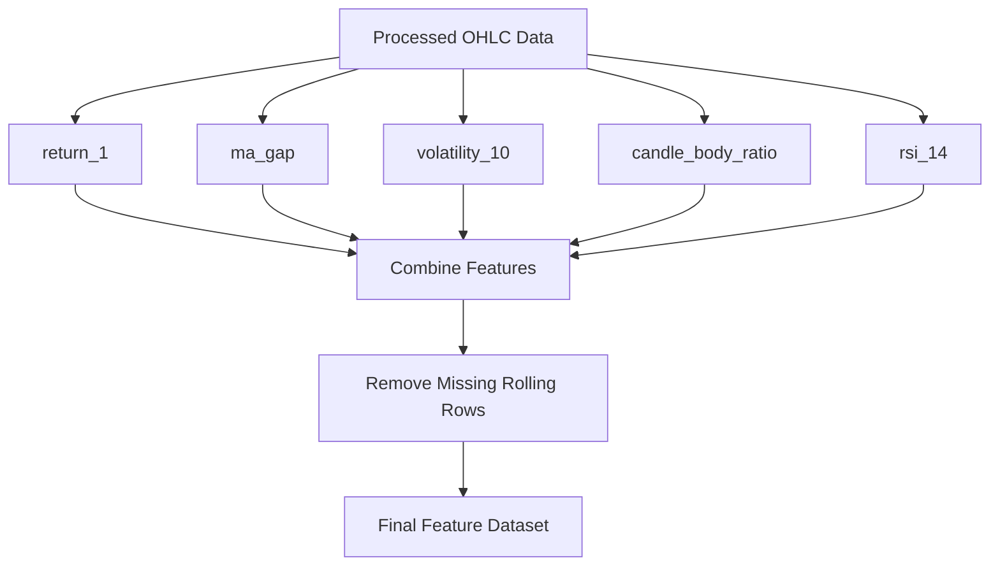

---

## 12. Model Features

The final models use five engineered features.

| Feature | Meaning | Reason for inclusion |
|---|---|---|
| `return_1` | Previous one-hour percentage return | Captures immediate momentum |
| `ma_gap` | Distance between current close and moving average | Represents trend position |
| `volatility_10` | Rolling standard deviation of recent returns | Captures changing market uncertainty |
| `candle_body_ratio` | Candle body relative to high-low range | Measures intrabar directional strength |
| `rsi_14` | 14-period Relative Strength Index | Represents recent momentum balance |

All features use only current and historical information.

---

# Part 3: Model Training

## 13. Training Architecture

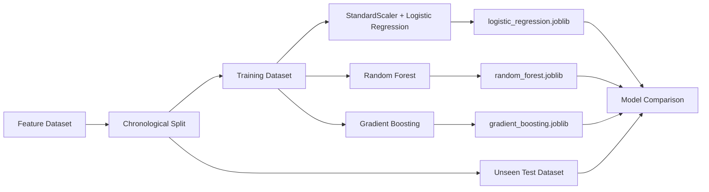

---

## 14. Why Chronological Splitting Is Required

Random splitting is inappropriate for financial time-series data because it can place future observations in the training set.

The project follows:

```text
Older observations → Training set
Newer observations → Testing set
```

The split is approximately:

```text
80% training
20% testing
```

A boundary row may be purged to reduce leakage between adjacent training and testing periods.

---

## 15. Models

### 15.1 Logistic Regression

Logistic Regression is used as the interpretable baseline.

The pipeline applies feature scaling before classification:

```python
Pipeline(
    steps=[
        ("scaler", StandardScaler()),
        (
            "classifier",
            LogisticRegression(
                max_iter=1000,
                random_state=42,
            ),
        ),
    ]
)
```

### 15.2 Random Forest

Random Forest is included to test whether an ensemble of decision trees can learn nonlinear relationships between the five features and the next-candle direction.

```python
RandomForestClassifier(
    n_estimators=200,
    random_state=42,
    n_jobs=-1,
)
```

Tree-based models do not require feature scaling.

### 15.3 Gradient Boosting

Gradient Boosting builds decision trees sequentially, with each new estimator attempting to correct errors made by previous estimators.

```python
GradientBoostingClassifier(
    random_state=42,
)
```

It is included to test a second nonlinear learning approach.

---

## 16. Training Sequence

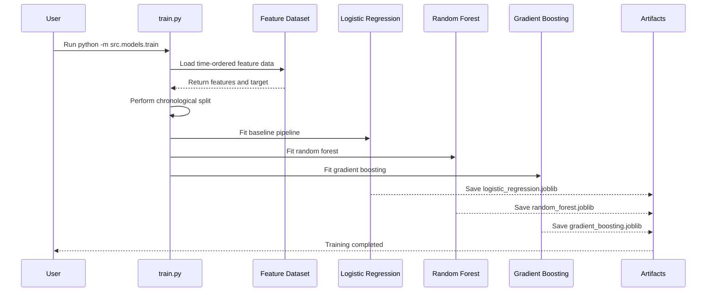

---

# Part 4: Validation and Evaluation

## 17. Time-Series Validation

Validation folds preserve chronological order.

```text
Fold 1: Train on early history → validate on later history
Fold 2: Train on larger history → validate on a later window
Fold 3: Train on larger history → validate on the final validation window
```

At no point does a model learn from observations that occur after its validation period.

---

## 18. Model Performance Comparison

The three models were evaluated on the same unseen chronological test period.

| Model | Accuracy | Balanced Accuracy | Precision | Recall | F1 Score | ROC-AUC |
|---|---:|---:|---:|---:|---:|---:|
| Logistic Regression | **50.45%** | 50.50% | 47.49% | 51.27% | 49.31% | 51.80% |
| Random Forest | **51.50%** | **51.63%** | **48.56%** | 53.82% | 51.06% | **52.06%** |
| Gradient Boosting | 49.55% | 50.64% | 47.47% | **68.79%** | **56.18%** | 49.50% |

### Interpretation

- Logistic Regression achieved the highest accuracy, balanced accuracy, and ROC-AUC.
- Gradient Boosting achieved the highest recall and F1 score.
- Random Forest produced a similar ROC-AUC to Logistic Regression but lower overall accuracy.
- All results remain close to 50%, which reflects the difficulty of predicting short-term financial-market direction.

These results must not be interpreted as guaranteed profitability.

---

## 19. Evaluation Sequence

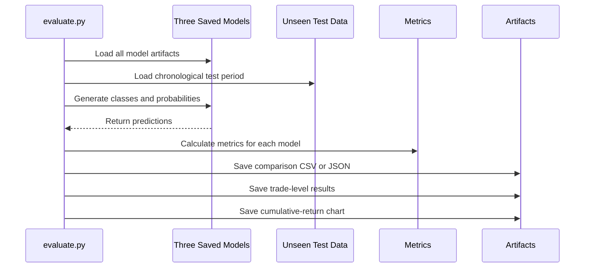

---

## 20. Trading Evaluation

The evaluation module may convert model predictions into a simplified directional strategy.

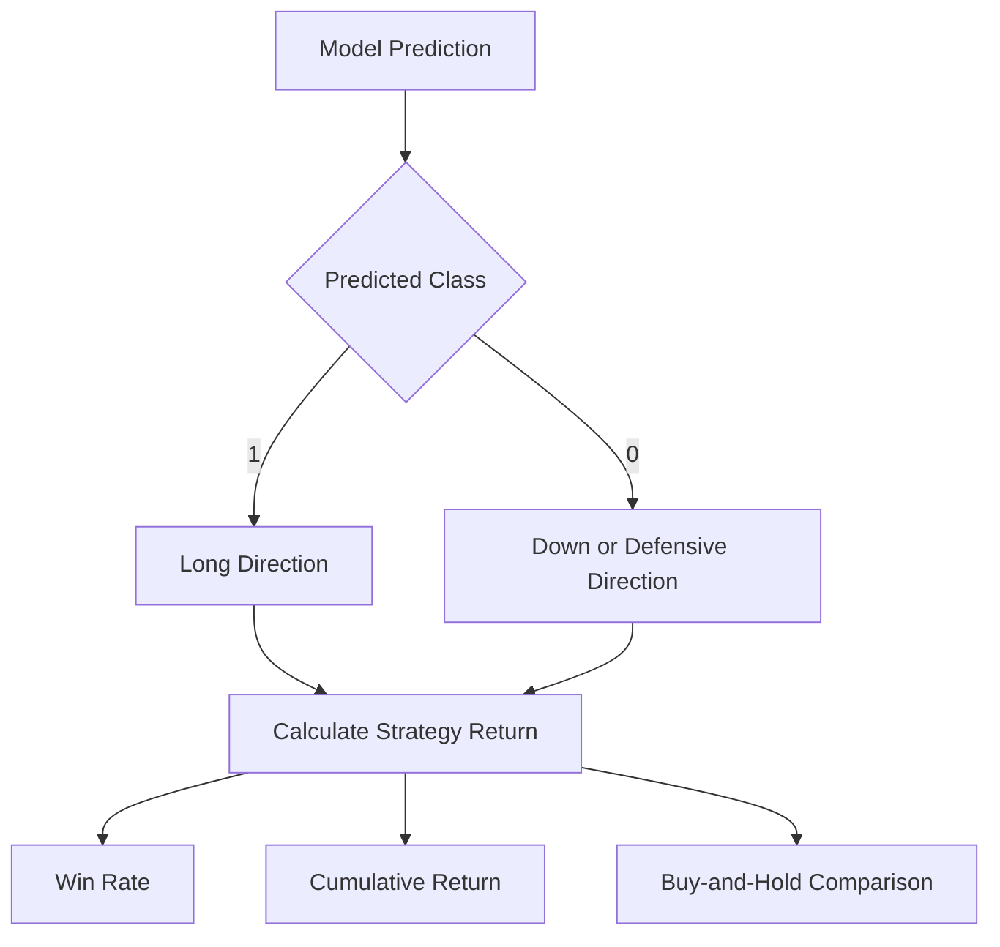

The backtest does not include:

- Bid-ask spread
- Brokerage or commissions
- Slippage
- Execution delay
- Market-impact costs

---

## 21. Generated Artifacts

```text
artifacts/
├── models/
│   ├── logistic_regression.joblib
│   ├── random_forest.joblib
│   └── gradient_boosting.joblib
├── model_comparison.csv
├── evaluation_metrics.json
├── cumulative_returns.png
└── test_period_trades.csv
```

| Artifact | Purpose |
|---|---|
| `logistic_regression.joblib` | Stores the scaled Logistic Regression pipeline |
| `random_forest.joblib` | Stores the trained Random Forest |
| `gradient_boosting.joblib` | Stores the trained Gradient Boosting model |
| `model_comparison.csv` | Stores metrics for all three models |
| `evaluation_metrics.json` | Stores detailed evaluation information |
| `cumulative_returns.png` | Compares strategy and benchmark returns |
| `test_period_trades.csv` | Stores test-period predictions and returns |

---

# Part 5: FastAPI Prediction Service

## 22. API Architecture

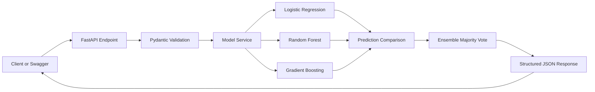

---

## 23. API Startup Sequence

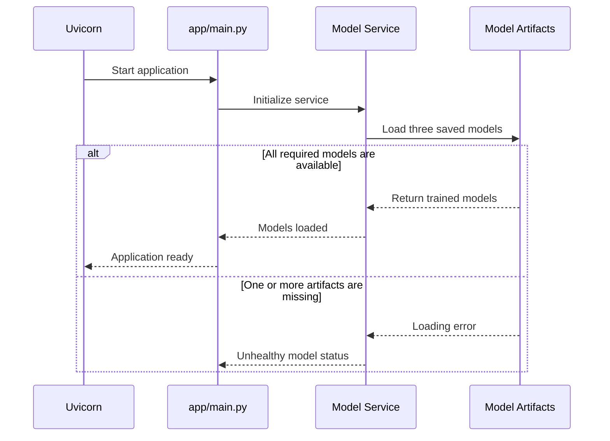

---

## 24. API Endpoints

| Method | Endpoint | Responsibility |
|---|---|---|
| `GET` | `/` | Returns API information |
| `GET` | `/health` | Returns service and model-loading status |
| `GET` | `/model/info` | Returns model names, metadata, and feature names |
| `POST` | `/predict/compare` | Compares predictions from all three models using supplied features |
| `GET` | `/predict/latest` | Downloads recent Yahoo Finance data, builds features, and predicts the latest candle |

---

## 25. Manual Model Comparison Sequence

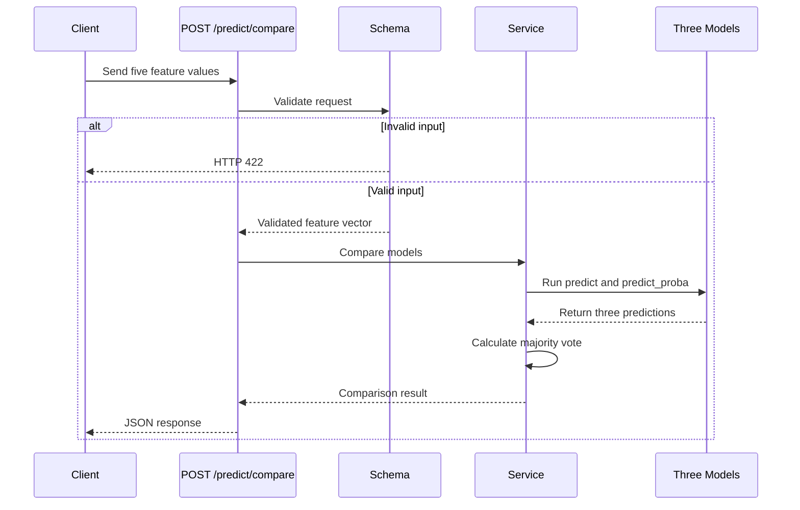

Example request:

```json
{
  "return_1": 0.0012,
  "ma_gap": -0.0021,
  "volatility_10": 0.0045,
  "candle_body_ratio": 0.62,
  "rsi_14": 54.3
}
```

Example response structure:

```json
{
  "predictions": {
    "logistic_regression": {
      "predicted_class": 1,
      "direction": "up",
      "probability_up": 0.53,
      "probability_down": 0.47
    },
    "random_forest": {
      "predicted_class": 0,
      "direction": "down_or_flat",
      "probability_up": 0.49,
      "probability_down": 0.51
    },
    "gradient_boosting": {
      "predicted_class": 1,
      "direction": "up",
      "probability_up": 0.55,
      "probability_down": 0.45
    }
  },
  "ensemble_prediction": {
    "predicted_class": 1,
    "direction": "up"
  }
}
```

Exact response keys and probability values depend on the current application schema and trained artifacts.

---

## 26. Latest Prediction Sequence

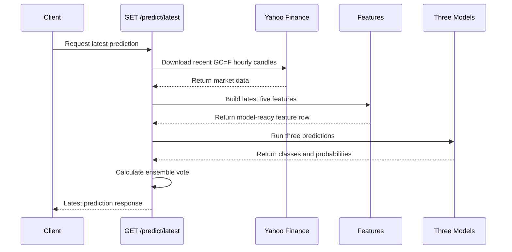

This endpoint demonstrates the complete inference workflow:

```text
Yahoo Finance
    ↓
Latest Hourly Candles
    ↓
Validation and Feature Engineering
    ↓
Three Model Predictions
    ↓
Ensemble Majority Vote
    ↓
JSON Response
```

---

# Part 6: Docker and Testing

## 27. Docker Architecture

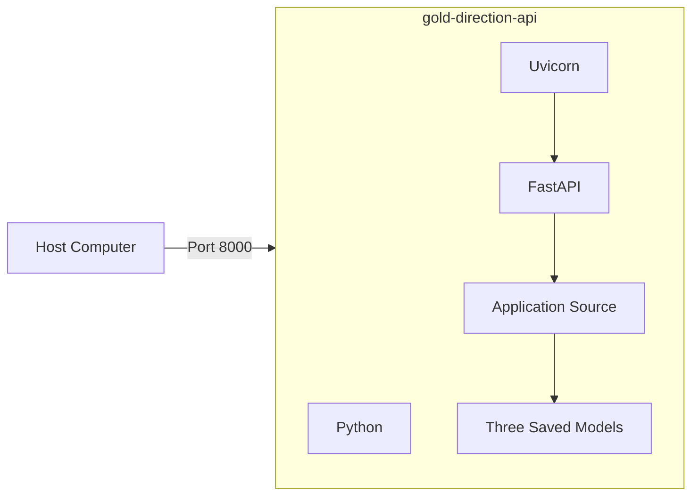

Build and run:

```bash
docker build -t gold-direction-api .
docker run -d --name gold-direction-container -p 8000:8000 gold-direction-api
```

---

## 28. Testing Strategy

The test suite should verify:

- Data download validation
- Data preprocessing
- Feature generation
- Chronological splitting
- Training all three models
- Saving all three artifacts
- Metric calculation
- Model comparison
- API health
- Model metadata
- `/predict/compare`
- `/predict/latest`
- Invalid request handling

Because the implementation has changed from one model to three models, tests that expect a single artifact or `/predict` endpoint should also be updated.

---

# Part 7: Execution Order

## 29. Recommended Command Sequence

```bash
python -m src.data.download
python -m src.data.preprocess
python -m src.features.build_features
python -m src.models.train
python -m src.models.validate
python -m src.models.evaluate
uvicorn app.main:app --reload
```

Open:

```text
Swagger:          http://127.0.0.1:8000/docs
Health:           http://127.0.0.1:8000/health
Model information:http://127.0.0.1:8000/model/info
Latest prediction:http://127.0.0.1:8000/predict/latest
```

---

# Part 8: Design Decisions

## 30. Why Three Models Are Compared

The three models represent different learning approaches:

| Model | Learning approach |
|---|---|
| Logistic Regression | Linear and interpretable baseline |
| Random Forest | Bagged nonlinear decision trees |
| Gradient Boosting | Sequential nonlinear boosting |

Using the same dataset and test period makes it possible to assess whether model complexity provides a meaningful improvement.

The final results show that no single model dominates every metric:

- Logistic Regression performs best on accuracy and ROC-AUC.
- Gradient Boosting performs best on recall and F1.
- Random Forest remains competitive but does not lead the comparison.

---

## 31. Why an Ensemble Vote Is Returned

A majority vote summarizes the three model outputs.

For example:

```text
Logistic Regression → UP
Random Forest       → DOWN_OR_FLAT
Gradient Boosting   → UP

Ensemble            → UP
```

The ensemble is a comparison aid. It is not proof that the prediction is correct or profitable.

---

## 32. Why FastAPI Is Used

FastAPI provides:

- Automatic request validation
- Interactive Swagger documentation
- Structured JSON responses
- Strong Python typing
- Easy integration with scikit-learn
- Straightforward Docker deployment

---

# Part 9: Limitations

## 33. Technical Limitations

- Yahoo Finance may return delayed or missing candles.
- `GC=F` is Gold Futures, not exact broker-specific spot XAU/USD.
- The dataset is still relatively small.
- Only five engineered features are used.
- The latest candle may be incomplete.
- Hyperparameters are limited and may not be optimized.
- Automatic retraining and model-drift monitoring are not implemented.
- The API does not maintain a prediction-history database.

---

## 34. Financial Limitations

- Gold markets are noisy and difficult to predict.
- Metrics close to 50% indicate a weak directional edge.
- Historical relationships may not continue.
- Transaction costs, spread, slippage, and latency are not included.
- Backtest performance does not guarantee live profitability.
- This project is for technical demonstration, not financial advice.

---

# Part 10: Future Architecture

## 35. Possible Extensions

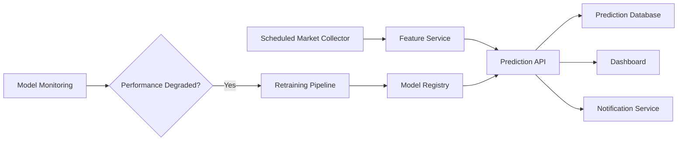

Potential future improvements:

- Walk-forward optimization
- Hyperparameter search
- XGBoost, LightGBM, or CatBoost
- Probability calibration
- Feature-importance reporting
- Additional technical indicators
- Macroeconomic and news features
- Prediction history
- Scheduled retraining
- Model-drift monitoring
- Cloud deployment
- Dashboard and notifications

---

## 36. Final Architecture Summary

```text
Yahoo Finance GC=F
    ↓
Validation and Preprocessing
    ↓
Next-Hour Target Creation
    ↓
Five-Feature Engineering
    ↓
Chronological Train-Test Split
    ↓
Logistic Regression
Random Forest
Gradient Boosting
    ↓
Model Comparison and Backtest
    ↓
Saved Models and Evaluation Artifacts
    ↓
FastAPI
    ↓
/predict/compare and /predict/latest
    ↓
Docker Deployment
```

The architecture separates data acquisition, feature engineering, training, evaluation, serving, testing, and deployment. This makes the project easier to understand, reproduce, test, and extend.