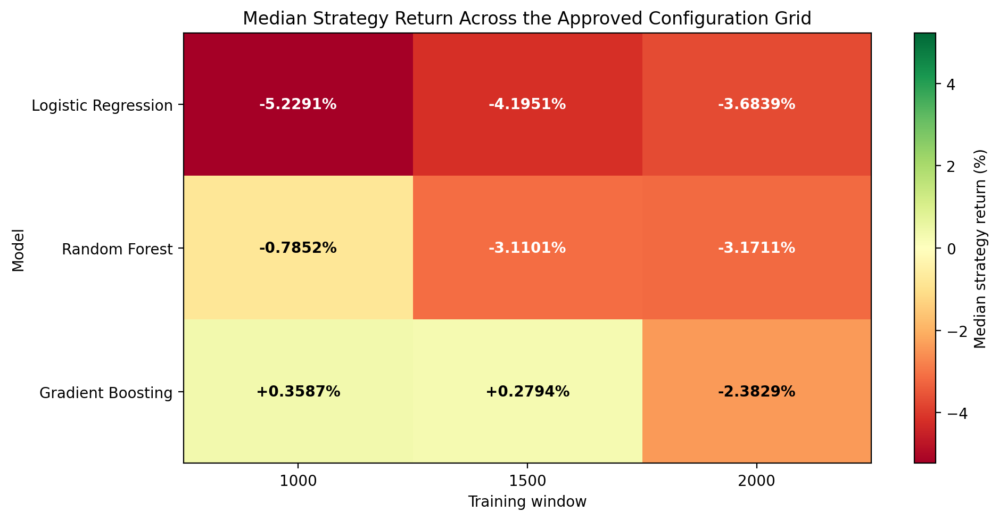

# Brief 02: Configuration Sweep and Selection-Adjusted Noise Floor

## 1. Objective

Brief 01 established that the baseline Logistic Regression configuration did not demonstrate a reliable gold-direction edge under walk-forward validation.

Brief 02 examined whether that result was limited to one model and window configuration or whether the absence of a reliable edge remained consistent across a modest configuration search.

The experiment had two connected objectives:

1. Run a declared configuration sweep using the existing leakage-safe walk-forward evaluation pipeline.
2. Test whether the best configuration was genuinely informative or merely the strongest result selected from several noisy candidates.

The principal research question was:

> Does any approved model and training-window configuration demonstrate a reliable gold-direction edge, or is the apparent winner consistent with configuration snooping?

---

## 2. Dataset

The experiment used the committed processed dataset:

```text
data/processed/gold_features.csv
```

Dataset details:

| Property   |                            Value |
| ---------- | -------------------------------: |
| Total rows |                            3,336 |
| Start      |          2025-12-16 01:00:00 UTC |
| End        |          2026-07-21 09:00:00 UTC |
| Frequency  |                           Hourly |
| Target     | Next-period gold-price direction |

The committed data snapshot was used for both the real grid and every permutation run.

---
## Version-Specific Reproducibility

The committed Brief 02 artifacts were generated using the following reference
environment:

- Python: 3.10.5
- scikit-learn: 1.7.2
- pandas: 2.3.3
- NumPy: 2.2.6
- Random seed: 42
- Permutation repetitions: 500

Logistic Regression reproduced identically when independently tested on a newer
numerical-library stack. However, Random Forest results and one Gradient
Boosting result changed across scikit-learn versions.

A fixed `random_state` makes stochastic estimators deterministic within a fixed
library implementation. It does not guarantee byte-identical bootstrap
sampling, tree construction, or fitted results across different scikit-learn
versions.

Therefore:

- The exact committed per-cell values should be reproduced using the reference
  environment listed above.
- Random Forest and Gradient Boosting per-cell results may differ across
  scikit-learn versions.
- The identity of the highest-ranked real configuration may change across
  versions.
- The principal scientific conclusion remains robust: the best real
  configuration does not clear the selection-adjusted permutation noise floor.

The robust result of this experiment is the no-edge conclusion under the null,
not the exact identity or return of the top-ranked tree-model configuration
across different library versions.
---
## 3. Approved Configuration Grid

The configuration sweep was driven by:

```text
config/walk_forward_grid.yaml
```

The approved grid contained three models:

* Logistic Regression
* Random Forest
* Gradient Boosting

Three training-window sizes were evaluated:

* 1,000 rows
* 1,500 rows
* 2,000 rows

The remaining walk-forward settings were fixed:

| Setting     | Value |
| ----------- | ----: |
| Test window |   250 |
| Step size   |   250 |
| Purge gap   |     1 |

The experiment therefore contained:

```text
3 models × 3 training windows = 9 grid cells
```

This was a train-window sensitivity scan across three models. It was not intended to be a full search over every possible train, test, and step combination.

The grid was kept deliberately modest to limit configuration searching and preserve a clearly declared experimental design.

---

## 4. Walk-Forward Methodology

Every grid cell reused the existing:

```text
walk_forward_split
evaluate_fold
```

No fold-generation or evaluation logic was copied into the grid runner.

Each fold followed the same sequence:

1. Select the historical training window.
2. Exclude the purge row.
3. Evaluate on the immediately following test window.
4. Create and fit a fresh model.
5. Calculate classification and strategy metrics.
6. Advance by the declared step size.

The evaluation reported distributions across folds rather than relying on a bare arithmetic mean.

Per-cell metrics included:

* Median accuracy
* Median ROC-AUC
* Median win rate
* Median strategy return
* Percentage of folds beating buy-and-hold
* Worst-fold strategy return

---

## 5. Real Grid Result

The highest-ranked real-data configuration was:

| Property                   |            Result |
| -------------------------- | ----------------: |
| Model                      | Gradient Boosting |
| Train/Test/Step            |      1000/250/250 |
| Number of folds            |                 9 |
| Median accuracy            |            50.00% |
| Median ROC-AUC             |            0.5110 |
| Median win rate            |            50.00% |
| Median strategy return     |          +0.3587% |
| Worst-fold strategy return |          −9.6159% |
| Folds beating buy-and-hold |               6/9 |

The complete ranked results are available in:

```text
artifacts/grid_search/grid_summary.csv
```

The real-grid heatmap is available in:

```text
artifacts/grid_search/median_strategy_return_heatmap.png
```



Although the Gradient Boosting 1000/250/250 cell ranked first, its median accuracy and win rate remained near 50%, its median strategy return was small, and its worst fold remained materially negative.

It was therefore treated as a candidate requiring statistical validation, not as evidence of a genuine edge.

---

## 6. Why a Selection-Adjusted Null Was Required

The real winner was selected after comparing nine configurations.

Testing only the winning Gradient Boosting cell after selection would under-correct for configuration searching.

A single-cell permutation test would answer:

> Is this specific configuration stronger than random?

However, the actual experiment selected the maximum result from nine cells. The correct question was:

> Is the best result selected from nine real cells stronger than the best result selected from nine no-signal cells?

The null procedure therefore repeated the complete selection process.

---

## 7. Permutation Method

For each permutation:

1. The target labels were randomly shuffled across the complete series.
2. Features, timestamps, returns, row indexes, and dataset length were preserved.
3. Target class counts were preserved.
4. The complete nine-cell grid was rerun.
5. The same walk-forward fold generator and `evaluate_fold` function were reused.
6. The maximum median strategy return across the nine cells was recorded.

This produced one best-of-nine no-signal result per permutation.

The procedure was repeated with:

| Setting          |                          Value |
| ---------------- | -----------------------------: |
| Repetitions      |                            500 |
| Seed             |                             42 |
| Selection metric | Maximum median strategy return |

The permutation runner also asserted that the real and permuted grids used identical fold boundaries for every cell.

---

## 8. Selection-Adjusted Null Results

The final null distribution produced:

| Metric                                        |                   Result |
| --------------------------------------------- | -----------------------: |
| Real best median strategy return              |                 +0.3587% |
| Null first quartile                           |                 +1.8811% |
| Null median                                   |                 +2.9898% |
| Null third quartile                           |                 +4.2711% |
| Null IQR                                      | 2.3900 percentage points |
| Null 95th percentile                          |                 +6.1941% |
| Null maximum                                  |                 +9.6844% |
| Null results meeting or exceeding real result |                  474/500 |
| Real-result percentile                        |                     5.2% |
| Empirical p-value                             |                 0.948104 |

The empirical p-value used the plus-one correction:

```text
p = (exceedance count + 1) / (permutations + 1)
```

For this experiment:

```text
p = (474 + 1) / (500 + 1)
p = 475 / 501
p = 0.948104
```

Approximately 94.8% of the shuffled no-signal grids produced a best-of-nine configuration at least as strong as the real winner.

---

## 9. Interpretation

The real winner’s median strategy return of +0.3587% was:

* Below the null median of +2.9898%
* Below the null first quartile of +1.8811%
* Near the fifth percentile of the null distribution
* Exceeded by 474 of 500 shuffled-grid winners

The result therefore does not clear the selection-adjusted noise floor.

The small positive return observed for Gradient Boosting is not distinguishable from the type of winner naturally created by selecting the maximum result from nine noisy configurations.

The experiment does not support deploying the model for daily gold-direction prediction or real-money trading.

---

## 10. Final Verdict

Across the approved three-model train-window sensitivity scan, no configuration demonstrates a reliable gold-direction edge.

The apparent Gradient Boosting winner at 1000/250/250 does not survive the selection-adjusted permutation test. Its performance is consistent with configuration snooping rather than genuine predictive signal.

This conclusion is limited to the evaluated:

* Dataset and historical period
* Feature set
* Next-period direction target
* Three model families
* Three approved training-window sizes
* Fixed test and step settings

The result does not prove that gold direction is impossible to predict under every possible dataset or modelling approach. It shows that no reliable edge was found within the approved configuration grid.

---

## 11. Reproducibility

Run the real configuration grid:

```bash
python -m src.models.walk_forward_grid
```

Run the complete selection-adjusted permutation analysis:

```bash
python -m src.models.walk_forward_permutation
```

Run the tests:

```bash
pytest
```

Generated artifacts:

```text
artifacts/grid_search/grid_report.json
artifacts/grid_search/grid_summary.csv
artifacts/grid_search/median_strategy_return_heatmap.png
artifacts/grid_search/permutation_null.csv
artifacts/grid_search/permutation_report.json
```

The committed dataset and fixed permutation seed allow the experiment to be reproduced consistently.
