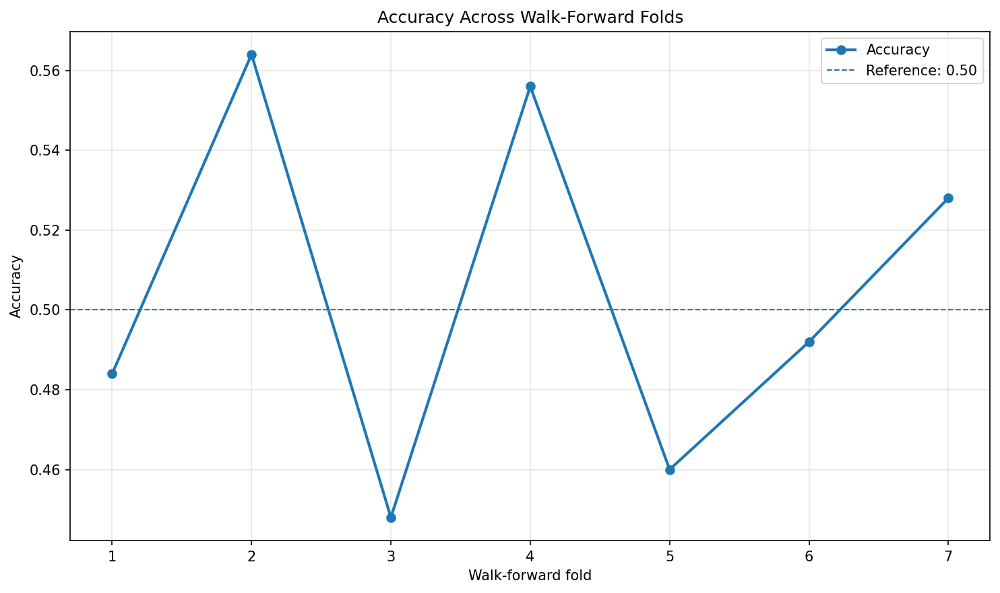
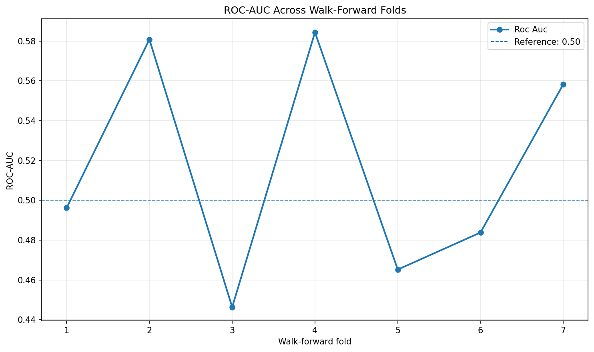
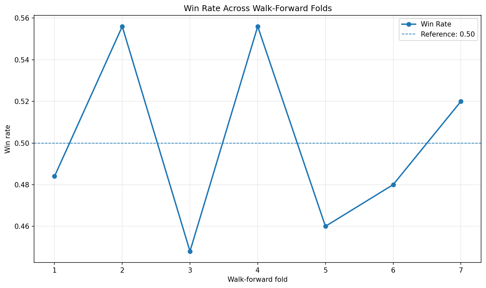
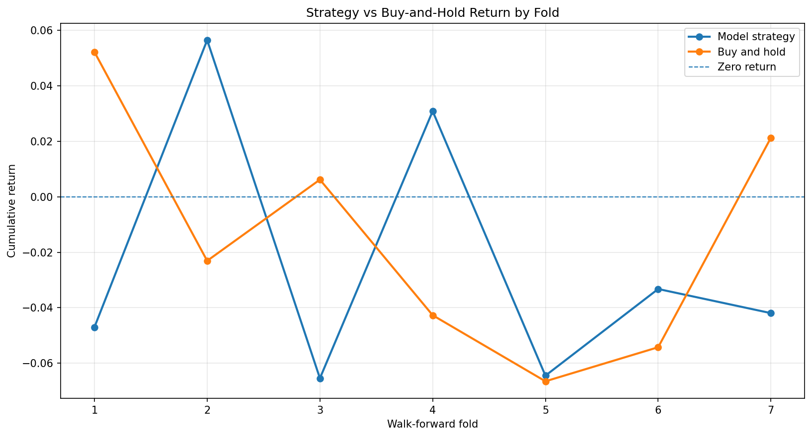

# Walk-Forward Validation for the Gold Price Direction Model

## Overview

This document describes the walk-forward validation harness added to the existing Gold Price Direction Predictor project.

The original project evaluated the model using one chronological train/test split. That evaluation was useful as an initial benchmark, but a single split cannot show whether model performance is stable across different market periods.

The walk-forward evaluation repeatedly:

1. Selects a fixed historical training window.
2. Removes a purged boundary row.
3. Tests only on the period immediately after the training window.
4. Moves forward by a configured step size.
5. Retrains a completely fresh model.
6. Repeats the process until the end of the committed dataset.

The purpose is not to force the model to produce strong results. The purpose is to determine honestly whether the model’s predictive and trading performance survives across changing market periods.

---

## Objectives

The walk-forward implementation was designed to provide:

* Config-driven training-window size.
* Config-driven test-window size.
* Config-driven step size.
* A configurable purge gap between training and testing.
* Fresh model training for every fold.
* No overlap between training and testing periods.
* Per-fold accuracy and ROC-AUC.
* Per-fold win rate.
* Per-fold strategy return.
* Per-fold buy-and-hold return.
* Prediction at time `t` scored against the realized return at `t + 1`.
* Aggregate median, quartiles, IQR, best fold, and worst fold.
* Percentage of folds where the strategy beats buy-and-hold.
* A machine-readable JSON report.
* A fold-level CSV report.
* Metric plots generated automatically.
* One-command reproduction from the committed data snapshot.

---

## Project Structure

The walk-forward implementation uses the following files:

```text
config/
└── walk_forward.yaml

src/
├── evaluation/
│   ├── aggregate_metrics.py
│   ├── walk_forward_plots.py
│   └── walk_forward_split.py
│
└── models/
    ├── evaluate.py
    ├── train.py
    └── walk_forward.py

tests/
└── test_walk_forward_split.py

artifacts/
└── walk_forward/
    ├── walk_forward_report.json
    ├── fold_results.csv
    ├── accuracy_by_fold.png
    ├── roc_auc_by_fold.png
    ├── win_rate_by_fold.png
    └── returns_by_fold.png
```

---

## Configuration

Walk-forward settings are stored in:

```text
config/walk_forward.yaml
```

The committed configuration is:

```yaml
model: logistic_regression
data_path: data/processed/gold_features.csv

train_window: 1500
test_window: 250
step_size: 250
purge_gap: 1
```

### Configuration values

| Setting        |                              Value | Purpose                                                     |
| -------------- | ---------------------------------: | ----------------------------------------------------------- |
| `model`        |              `logistic_regression` | Model retrained independently in every fold                 |
| `data_path`    | `data/processed/gold_features.csv` | Committed feature dataset                                   |
| `train_window` |                          1500 rows | Number of historical observations used for training         |
| `test_window`  |                           250 rows | Number of observations evaluated immediately after training |
| `step_size`    |                           250 rows | Number of rows the rolling window moves forward             |
| `purge_gap`    |                              1 row | Boundary row excluded between training and testing          |

The YAML configuration allows the window sizes to be changed without modifying the evaluation code.

---

## Walk-Forward Method

For every fold, the system calculates the following boundaries:

```text
training start
training end
purged boundary
testing start
testing end
```

Conceptually:

```text
Fold 1:
[-------- Training Window --------][Purge][--- Test Window ---]

Fold 2:
        [-------- Training Window --------][Purge][--- Test Window ---]

Fold 3:
                [-------- Training Window --------][Purge][--- Test Window ---]
```

The training window has a fixed size of 1,500 observations. After every fold, it moves forward by 250 observations.

The implementation continues generating folds until another complete 250-row test window can no longer fit inside the dataset.

---

## No-Look-Ahead Protection

The evaluation includes a one-row purged boundary between each training and test window.

For every fold:

```text
latest training row < earliest testing row
```

The training indexes and testing indexes must be disjoint:

```text
training indexes ∩ testing indexes = empty
```

The explicit leakage tests verify that:

* Training and testing windows never overlap.
* A training window never includes a row from its own test window.
* A training window never includes a later row.
* The configured purge gap is preserved.
* Fold boundaries do not exceed the dataset.
* Invalid window configurations are rejected.

Run the leakage tests with:

```bash
python -m pytest tests/test_walk_forward_split.py -v
```

---

## Fresh Model Training

Every fold creates a new, unfitted Logistic Regression pipeline.

The model trained in Fold 1 is not reused in Fold 2, and the model trained in Fold 2 is not reused in Fold 3.

```text
Fold 1 → fresh model → train → predict → evaluate

Fold 2 → fresh model → train → predict → evaluate

Fold 3 → fresh model → train → predict → evaluate
```

This prevents fitted model state from carrying between folds.

The trained fold models are used only for evaluation and are not repeatedly written over the official models inside `artifacts/models`.

---

## Prediction and Return Alignment

The target represents the direction of the next hourly candle.

Therefore, a prediction created using information available at time `t` must be evaluated using the market return at time `t + 1`.

```text
Features at time t
        ↓
Prediction at time t
        ↓
Realized return at time t + 1
```

The strategy return is calculated as:

```text
strategy return = trading position × next-period return
```

Binary predictions are converted into positions:

```text
Prediction 1 → Long position (+1)
Prediction 0 → Short position (-1)
```

This preserves the same timing logic used in the original `evaluate.py` pipeline.

---

## Metrics Calculated Per Fold

Each fold reports the following classification metrics:

* Accuracy
* Balanced accuracy
* Precision
* Recall
* F1 score
* ROC-AUC

Each fold also reports the following strategy metrics:

* Number of trades
* Winning trades
* Losing trades
* Win rate
* Cumulative strategy return
* Buy-and-hold return
* Average trade return
* Best trade return
* Worst trade return
* Strategy excess return
* Whether the strategy beats buy-and-hold

The required comparison is:

```text
strategy excess return =
strategy return - buy-and-hold return
```

---

## Running the Walk-Forward Evaluation

Activate the virtual environment:

```powershell
.venv\Scripts\Activate.ps1
```

Run the complete evaluation:

```bash
python -m src.models.walk_forward
```

This one command:

1. Loads `config/walk_forward.yaml`.
2. Loads the committed processed dataset.
3. Generates all valid rolling folds.
4. Extracts each fold’s train and test data.
5. Creates a fresh model for every fold.
6. Trains the model.
7. Generates predictions and probabilities.
8. Calculates classification metrics.
9. Calculates strategy and buy-and-hold returns.
10. Aggregates the fold distributions.
11. Writes the JSON report.
12. Writes the fold-results CSV.
13. Generates all walk-forward plots.

---

## Generated Artifacts

### JSON report

```text
artifacts/walk_forward/walk_forward_report.json
```

The report contains:

```text
model
configuration
dataset information
individual fold results
aggregate statistics
```

### Fold-level CSV

```text
artifacts/walk_forward/fold_results.csv
```

This provides a flat, tabular view of every fold and can be opened using spreadsheet software or loaded using pandas.

### Generated plots

```text
artifacts/walk_forward/accuracy_by_fold.png
artifacts/walk_forward/roc_auc_by_fold.png
artifacts/walk_forward/win_rate_by_fold.png
artifacts/walk_forward/returns_by_fold.png
```

These are generated charts, not manually created images.

---

## Walk-Forward Charts

### Accuracy by fold



The accuracy chart compares every fold against the `0.50` random-classification reference line.

### ROC-AUC by fold



The ROC-AUC chart shows whether ranking performance remains consistently above the `0.50` random baseline.

### Win rate by fold



The win-rate chart shows the percentage of trades with a positive strategy return in each fold.

### Strategy return versus buy-and-hold



This chart compares the model strategy return with the corresponding buy-and-hold return for each test period.

---

## Per-Fold Results

| Fold | Accuracy | ROC-AUC | Balanced Accuracy | Win Rate | Strategy Return | Buy-and-Hold | Excess Return | Beats Buy-and-Hold |
| ---: | -------: | ------: | ----------------: | -------: | --------------: | -----------: | ------------: | :----------------: |
|    1 |   48.40% |  0.4962 |            48.40% |   48.40% |          -4.70% |       +5.22% |        -9.93% |         No         |
|    2 |   56.40% |  0.5808 |            55.48% |   55.60% |          +5.65% |       -2.31% |        +7.96% |         Yes        |
|    3 |   44.80% |  0.4463 |            44.86% |   44.80% |          -6.54% |       +0.62% |        -7.16% |         No         |
|    4 |   55.60% |  0.5844 |            55.80% |   55.60% |          +3.09% |       -4.27% |        +7.36% |         Yes        |
|    5 |   46.00% |  0.4652 |            46.21% |   46.00% |          -6.45% |       -6.65% |        +0.20% |         Yes        |
|    6 |   49.20% |  0.4838 |            49.29% |   48.00% |          -3.32% |       -5.42% |        +2.10% |         Yes        |
|    7 |   52.80% |  0.5584 |            53.29% |   52.00% |          -4.20% |       +2.13% |        -6.33% |         No         |

---

## Aggregate Results

The walk-forward evaluation produced seven complete folds.

### Classification performance

| Metric            |   Mean | Median |     IQR | Minimum | Maximum | Worst Fold | Best Fold |
| ----------------- | -----: | -----: | ------: | ------: | ------: | ---------: | --------: |
| Accuracy          | 50.46% | 49.20% | 7.00 pp |  44.80% |  56.40% |     Fold 3 |    Fold 2 |
| ROC-AUC           | 0.5164 | 0.4962 |  0.0951 |  0.4463 |  0.5844 |     Fold 3 |    Fold 4 |
| Balanced accuracy | 50.48% | 49.29% | 7.08 pp |  44.86% |  55.80% |     Fold 3 |    Fold 4 |
| Win rate          | 50.06% | 48.40% | 6.80 pp |  44.80% |  55.60% |     Fold 3 |    Fold 2 |

### Strategy performance

| Metric                 |   Mean | Median |      IQR | Minimum | Maximum |
| ---------------------- | -----: | -----: | -------: | ------: | ------: |
| Strategy return        | -2.35% | -4.20% |  5.46 pp |  -6.54% |  +5.65% |
| Buy-and-hold return    | -1.53% | -2.31% |  6.22 pp |  -6.65% |  +5.22% |
| Strategy excess return | -0.83% | +0.20% | 11.47 pp |  -9.93% |  +7.96% |

Additional observations:

```text
Folds evaluated: 7
Folds beating buy-and-hold: 4
Percentage beating buy-and-hold: 57.14%
Folds with a positive strategy return: 2
Percentage with a positive strategy return: 28.57%
Worst strategy fold: Fold 3, -6.54%
Best strategy fold: Fold 2, +5.65%
```

---

## Interpretation

The model does not show stable performance across market periods.

Accuracy ranges from `44.80%` to `56.40%`, while ROC-AUC ranges from `0.4463` to `0.5844`. This is a wide variation for a binary direction model and indicates that performance is sensitive to the selected market period.

The median accuracy is `49.20%`, and the median ROC-AUC is `0.4962`. Both are approximately equal to random performance.

The median win rate is `48.40%`, which is also below the neutral `50%` level.

The median strategy return is `-4.20%`, and the average strategy return is `-2.35%`.

Although the strategy beats buy-and-hold in four of seven folds, only two folds produce a positive absolute strategy return. In Fold 5 and Fold 6, the strategy is counted as beating buy-and-hold because it loses less money than buy-and-hold, not because it generates a positive return.

For example:

```text
Fold 5:
Strategy return:     -6.45%
Buy-and-hold return: -6.65%

Fold 6:
Strategy return:     -3.32%
Buy-and-hold return: -5.42%
```

Therefore, the `57.14%` beat rate must not be interpreted as evidence of a profitable or dependable trading signal.

The strategy excess return also has a very wide IQR of approximately `11.47` percentage points. This indicates substantial instability between folds.

---

## Does the Model Survive Walk-Forward Validation?

No.

The current gold-direction model does not demonstrate a stable out-of-sample predictive or trading edge under walk-forward validation.

The evidence is:

* Median accuracy is below `50%`.
* Median ROC-AUC is approximately `0.50`.
* Median win rate is below `50%`.
* Median strategy return is negative.
* Mean strategy excess return is negative.
* Only two of seven folds have a positive strategy return.
* Results vary considerably between folds.
* Good performance in Fold 2 and Fold 4 does not persist across later periods.

The model appears to be regime-dependent. It performs above random in some market periods and below random in others.

The single-split benchmark therefore does not generalize consistently across the full historical period.

Based on this evaluation, the current model should not be treated as having a reliable edge and should not be used for capital deployment without additional research and validation.

---

## Reproducibility

The official benchmark uses the committed processed dataset:

```text
data/processed/gold_features.csv
```

To reproduce the committed evaluation, do not run the market-data download step first.

Run:

```bash
python -m src.models.walk_forward
```

This will use:

```text
config/walk_forward.yaml
```

and regenerate:

```text
artifacts/walk_forward/walk_forward_report.json
artifacts/walk_forward/fold_results.csv
artifacts/walk_forward/accuracy_by_fold.png
artifacts/walk_forward/roc_auc_by_fold.png
artifacts/walk_forward/win_rate_by_fold.png
artifacts/walk_forward/returns_by_fold.png
```

Downloading current market data will change:

* The dataset date range.
* The number of available rows.
* The fold periods.
* The number of folds.
* Model metrics.
* Trading results.
* Generated reports and plots.

That is expected for a rolling public-data source, but it will no longer represent the committed benchmark.

---

## Verification Commands

Run all tests:

```bash
python -m pytest
```

Run type checking:

```bash
mypy src app
```

Run the complete walk-forward pipeline:

```bash
python -m src.models.walk_forward
```

Validate the JSON report:

```powershell
python -m json.tool artifacts\walk_forward\walk_forward_report.json > $null
```

Check that all generated files exist:

```powershell
Test-Path artifacts\walk_forward\walk_forward_report.json
Test-Path artifacts\walk_forward\fold_results.csv
Test-Path artifacts\walk_forward\accuracy_by_fold.png
Test-Path artifacts\walk_forward\roc_auc_by_fold.png
Test-Path artifacts\walk_forward\win_rate_by_fold.png
Test-Path artifacts\walk_forward\returns_by_fold.png
```

All checks should return `True`.

Check file sizes:

```powershell
Get-Item artifacts\walk_forward\* |
Select-Object Name, Length, LastWriteTime
```

The JSON, CSV, and PNG files should all have file sizes greater than zero.

---

## Final Conclusion

The walk-forward harness successfully extends the original gold predictor from a single chronological split to repeated rolling-origin evaluation.

The implementation is reproducible, config-driven, leakage-aware, and produces per-fold classification and strategy metrics, aggregate distribution statistics, JSON and CSV reports, and metric plots.

The evaluation shows that the current model does not have a stable out-of-sample edge.

Its median predictive performance is approximately random, its median strategy return is negative, and its results vary materially across market periods.

This is a negative modeling result but a successful evaluation result: the walk-forward framework correctly reveals that the apparent signal is not sufficiently stable for capital deployment.
